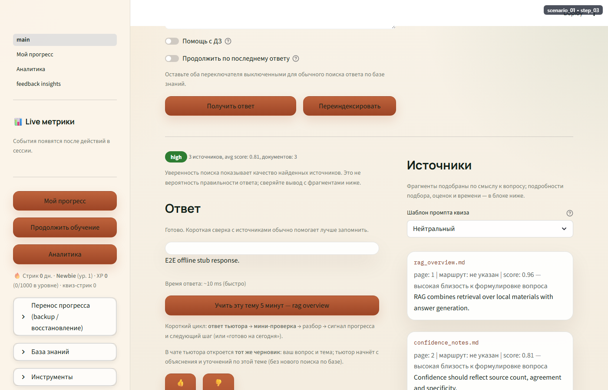
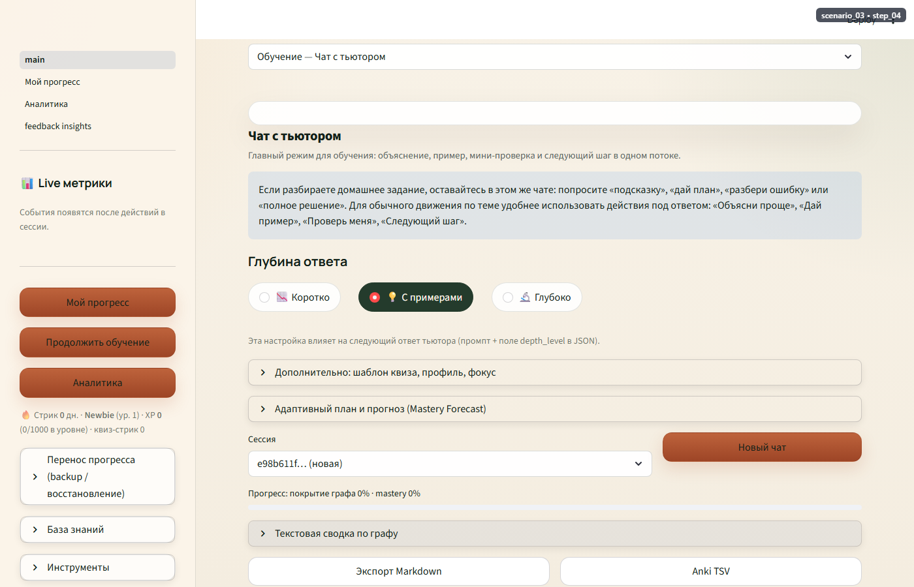
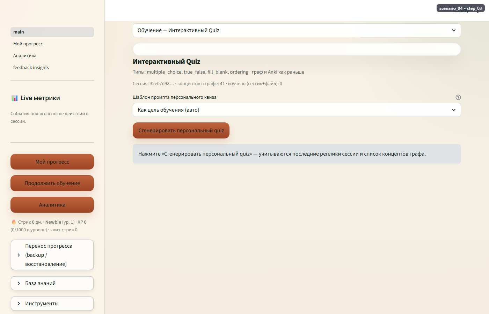
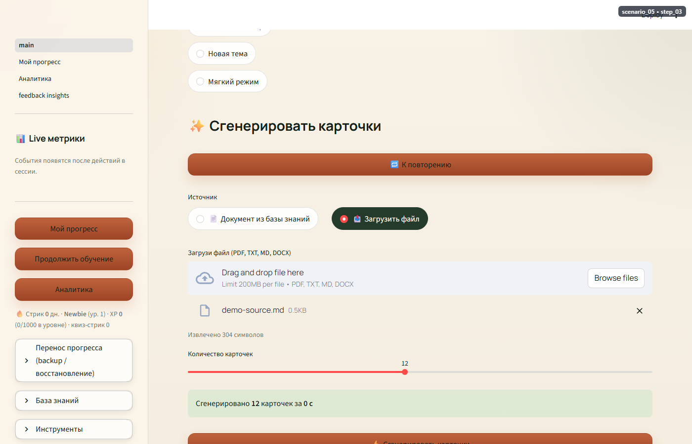
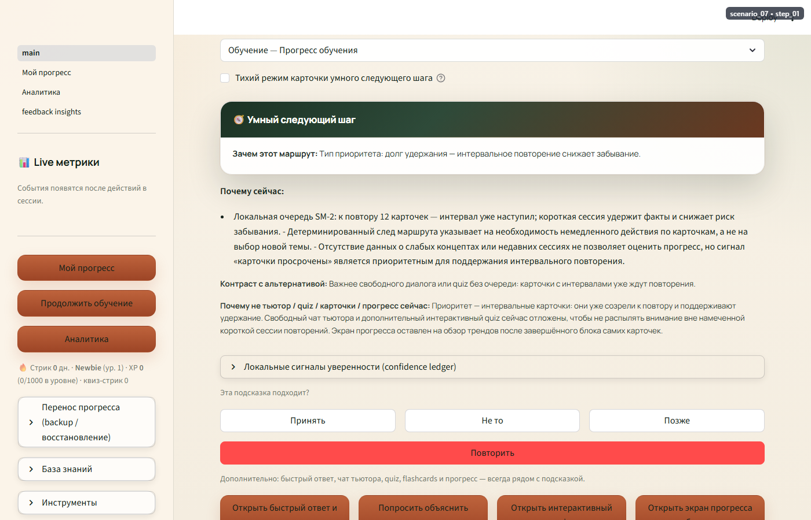
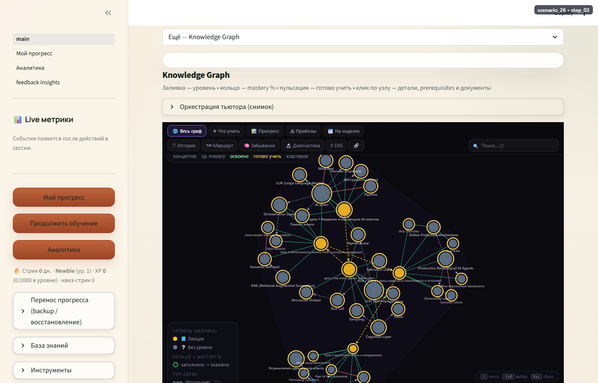

# hometutor — ИИ-тьютор с RAG

[](https://github.com/ktolmachov/hometutor/actions/workflows/ci.yml)

Локальный учебный RAG-сервис: загружаешь свои конспекты/лекции — получаешь поиск с
источниками, AI-тьютора, квизы, флеш-карты со spaced repetition, граф знаний и
персональный план обучения. FastAPI + Streamlit + Chroma/BM25 + OpenAI-совместимые
LLM/embeddings, локально-ориентированный (local-first), с опциональной аутентификацией
и облачным деплоем.

## Идея и функциональность

hometutor превращает папку с учебными материалами в персонального ИИ-репетитора:

- **Ответы с источниками** — RAG поверх ваших документов, с confidence-оценкой и
  кликабельными фрагментами-источниками (без «галлюцинаций без доказательств»).
- **Tutor-чат** — многошаговый разбор темы: план → объяснение → проверка понимания,
  с адаптацией к уровню (assistance level) и истории сессии.
- **Quiz** — генерация вопросов по теме/документу, мгновенный feedback, перенос ошибок
  в колоду флеш-карт.
- **Flashcards + SRS** — редактируемый preview перед сохранением, интервальное повторение
  (SM-2), экспорт в Anki.
- **Knowledge Graph** — персональный подграф концептов с mastery-статусом и навигацией
  к слабым местам.
- **Smart Study Router (SSR)** — один лучший следующий шаг с объяснением «почему сейчас»
  и прозрачным evidence-следом локальных сигналов.
- **Прогресс и аналитика** — mastery vector, streak, weak spots, адаптивный план на день/неделю.
- **Аутентификация** — опциональная регистрация/вход (JWT + bcrypt), прогресс изолирован
  по пользователю.

Подробнее: [docs/user_guide.md](docs/user_guide.md), [docs/architecture.md](docs/architecture.md),
демо-витрина сценариев — [docs/quickstart_demo.md](docs/quickstart_demo.md).

## Демо

Публичное демо разворачивается на Hugging Face Spaces (Docker SDK, см.
[deploy/hf-spaces/README.md](deploy/hf-spaces/README.md)):

> 🔗 **Демо-ссылка:** `https://huggingface.co/spaces/kt20252/hometutor`
> (заполняется после первого деплоя — см. инструкцию по ссылке выше).
> Демо работает на эфемерном диске контейнера: учётные записи и прогресс не персистентны
> между перезапусками Space — это ограничение бесплатного тарифа, не баг.

## Скриншоты

| Быстрый ответ с источниками | Tutor: объяснение | Quiz: мгновенный feedback |
|---|---|---|
|  |  |  |

| Flashcards: preview перед сохранением | Прогресс: mastery и streak | Knowledge Graph: подграф |
|---|---|---|
|  |  |  |

Полная витрина (30 сценариев, GIF + раскадровка) — [docs/quickstart_demo.md](docs/quickstart_demo.md).

## Технологии

- **Backend:** FastAPI, Uvicorn, Pydantic / pydantic-settings.
- **UI:** Streamlit (multipage).
- **Retrieval:** LlamaIndex, ChromaDB (вектор), BM25 (`bm25s`), FlagEmbedding reranker.
- **Аутентификация:** JWT (`PyJWT`) + bcrypt, SQLite (`auth.db`, per-user `user_state.db`).
- **Хранение состояния:** SQLite (learner state, прогресс, flashcards, SRS).
- **LLM/Embeddings:** любой OpenAI-совместимый провайдер (LM Studio, llama.cpp, OpenRouter, OpenAI).
- **CI/CD:** GitHub Actions (`ruff` + `pytest`, автодеплой на Hugging Face Spaces).
- **Деплой:** Docker, Hugging Face Spaces (Docker SDK).
- **Аналитика:** Яндекс.Метрика (опционально).

## Установка и запуск

### Локально (venv)

```powershell
python -m venv .venv
.\.venv\Scripts\python.exe -m pip install -r requirements.txt
```

`config.env` содержит tracked defaults. Локальные секреты и overrides кладите в `.env`:

```env
OPENAI_API_KEY=local-or-real-key
LLM_API_BASE=http://127.0.0.1:8080/v1
LLM_MODEL=your-local-model-id
EMBED_API_BASE=http://127.0.0.1:1234/v1
EMBED_MODEL=text-embedding-qwen3-embedding-0.6b

# Аутентификация (опционально; по умолчанию выключена — single-user режим без логина)
AUTH_ENABLED=false
# JWT_SECRET=<своё значение для прода, не дефолт из config.env>

# Аналитика (опционально)
# YANDEX_METRIKA_ID=<id счётчика>
```

Проверка окружения:

```powershell
.\.venv\Scripts\python.exe scripts\local_readiness.py
```

Если хотите хранить `data/`, `chroma_db/`, `logs/` и `index_registry.json` прямо в checkout:

```powershell
$env:HOME_RAG_HOME = (Get-Location).Path
```

Индексация и запуск:

```powershell
.\.venv\Scripts\python.exe ingest.py
.\scripts\local_start.ps1 -SkipPip
```

Ручной запуск в двух терминалах:

```powershell
.\.venv\Scripts\python.exe main.py
.\.venv\Scripts\streamlit.exe run app\ui\main.py
```

- Streamlit UI: http://127.0.0.1:8501
- API health: http://127.0.0.1:8000/health
- OpenAPI: http://127.0.0.1:8000/docs

С `AUTH_ENABLED=true` UI потребует регистрацию/вход; без флага (по умолчанию) — прежний
single-user режим без логина.

### Docker

```powershell
docker compose up --build
```

Для локальных LLM профилей:

```powershell
docker compose -f docker-compose.yml -f docker-compose.lmstudio.yml up --build
docker compose -f docker-compose.yml -f docker-compose.llamacpp.yml up --build
```

### Облачное демо (Hugging Face Spaces)

См. [deploy/hf-spaces/README.md](deploy/hf-spaces/README.md) — пошаговая инструкция (Docker SDK,
секреты, ограничения эфемерного демо). Автодеплой при пуше в `main` настраивается через
`.github/workflows/deploy.yml` (нужны секреты `HF_TOKEN`/`HF_USERNAME` в GitHub).

## CI/CD

`.github/workflows/ci.yml` запускает `ruff check` + `pytest` на каждый push/PR в `main`.
`.github/workflows/deploy.yml` пушит в Hugging Face Space после успешного прохождения CI
(если настроены секреты). Локально аналогично:

```powershell
.\.venv\Scripts\python.exe -m pip install ruff
.\.venv\Scripts\python.exe -m ruff check app tests
.\.venv\Scripts\python.exe -m pytest tests\ -q
```

## Основные документы

- [docs/index.md](docs/index.md) — карта актуальной runtime-документации.
- [docs/user_guide.md](docs/user_guide.md) — пользовательский путь и режимы приложения.
- [docs/quickstart.md](docs/quickstart.md) — локальный запуск и первый учебный цикл.
- [docs/quickstart_demo.md](docs/quickstart_demo.md) — demo-витрина GIF/PNG из `docs/screenshots/final/`.
- [docs/api_reference.md](docs/api_reference.md) — HTTP API.
- [docs/architecture.md](docs/architecture.md) — системная архитектура.
- [docs/technical_specification.md](docs/technical_specification.md) — runtime-модули, entrypoints, storage.
- [docs/AI_DEVELOPMENT.md](docs/AI_DEVELOPMENT.md) — как ИИ использовался на всех этапах разработки (промпты, решения, проблемы).

## Состав проекта

Этот репозиторий (`hometutor`) — продуктовый runtime: API, UI, индексация, learner state,
tutor, quiz, flashcards, Smart Study Router, Knowledge Graph и эксплуатационные документы.

Процессные материалы — backlog, user stories, сценарные манифесты, генератор demo-документа —
живут в соседнем репозитории **[`hometutor-studio`](https://github.com/ktolmachov/hometutor-studio)**.

## Эволюционные разборы

Серия исследовательских разборов архитектуры и качества продукта (без изменения runtime-кода):

| Разбор | Тема | analysis | implementation | outcome |
|--------|------|----------|----------------|---------|
| №24 Quiz Quality & Mastery Honesty | Качество квизов и честность mastery; VLQR | ✅ 2026-07-19 ([doc/next/24_quiz_quality_mastery_honesty.html](doc/next/24_quiz_quality_mastery_honesty.html), [plan](doc/next/quiz_quality_mastery_honesty_plan.md)) | ⬜ P0a+P0b planned | ⬜ pending live sample |

## Maintenance

```powershell
.\.venv\Scripts\python.exe scripts\check_chroma_health.py
.\.venv\Scripts\python.exe scripts\probe_graph_llm.py --live-doc --no-cache
.\.venv\Scripts\python.exe scripts\rebuild_knowledge_graph.py --dry-run
.\.venv\Scripts\python.exe scripts\audit_knowledge_graph.py
```

Опасные операции защищены confirmation token:

```powershell
.\.venv\Scripts\python.exe scripts\delete_all_data.py --verify-only --json
.\.venv\Scripts\python.exe scripts\fresh_start.py --confirm-token DELETE-ALL-LOCAL-HOME-RAG-DATA
```
