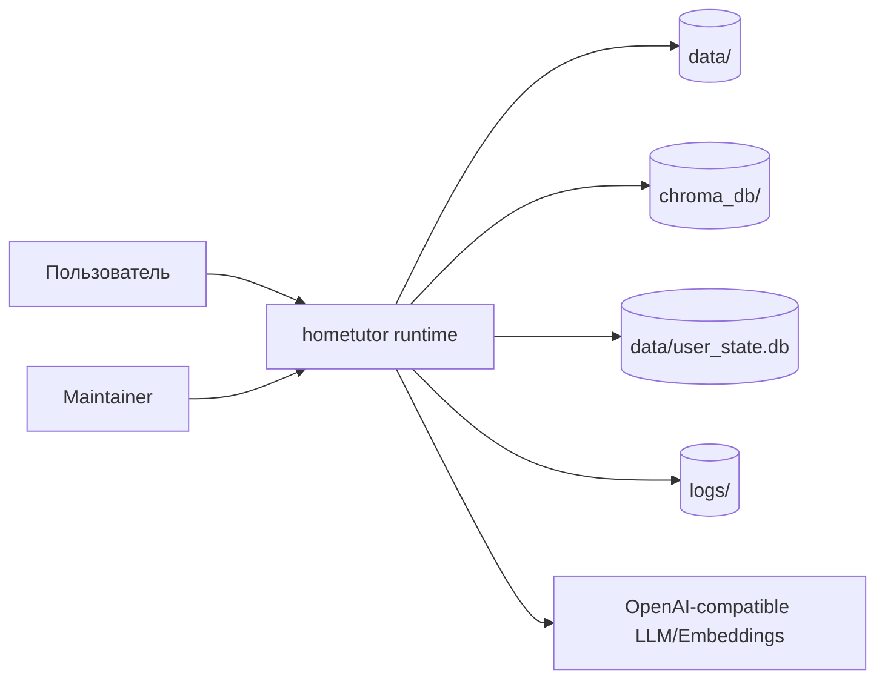
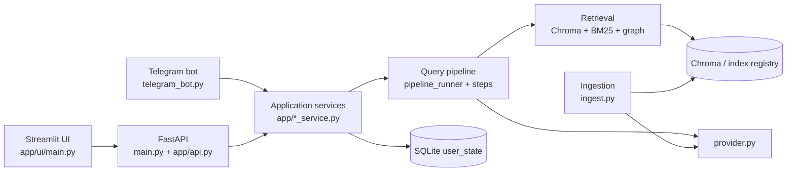
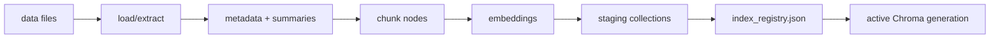
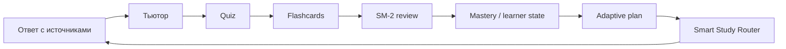

# Архитектура hometutor

Актуализировано по runtime-коду: 2026-06-23.

## Контекст

`hometutor` — локальное учебное RAG-приложение. Оно читает материалы из `data/`, строит индекс, отвечает с источниками, ведёт tutor/quiz/flashcards/progress контур и предлагает следующий шаг через Smart Study Router.

Этот репозиторий — runtime-продукт. Документы процесса, backlog, user stories, screenshot-витрина и длинные roadmap-артефакты не являются локальной частью `docs/`.

## System context

## Containers

Ключевая граница: Streamlit ходит в FastAPI через `app/ui_client.py`; Telegram использует service layer; индексация запускается отдельным entrypoint `ingest.py`.

## HTTP application

`app/api.py` собирает FastAPI application:

- middleware: logging, error handling, CORS, optional rate limit;
- lifespan warmups and shutdown cleanup;
- public core/SSR routes;
- protected runtime routes через `require_api_key`, если задан `HOME_RAG_API_KEY`.

Роутеры:

- `core`
- `ssr`
- `query`
- `sessions`
- `knowledge`
- `learner`
- `feedback`
- `quiz`
- `review`
- `flashcards`
- `dashboard`
- `sync`
- `files`
- `metrics`
- `admin`
- `debug_session_tape`

Подробная карта: [api_reference.md](api_reference.md).

## Query pipeline

Публичный профиль `/ask.profile` резолвится в bounded retrieval settings. Raw retrieval mode остаётся config/debug/admin surface.

## Tutor loop

Tutor route — это вариант `/ask`, а не отдельный HTTP endpoint. Он добавляет:

- learner goal snapshot;
- tutor pipeline contract;
- policy/personalization hints;
- optional micro-quiz;
- persisted multi-turn через `session_id`.

Основные модули:

- `app/tutor_orchestrator.py`
- `app/tutor_pipeline_contract.py`
- `app/tutor_learner_contract.py`
- `app/tutor_personalization_policy.py`
- `app/query_tutor_context.py`

## Indexing

Индексация поддерживает full/partial paths, extraction cache, registry activation и graph generation bundles.

Основные модули:

- `app/ingestion.py`
- `app/ingestion_loader.py`
- `app/ingestion_index_full.py`
- `app/ingestion_index_partial.py`
- `app/ingestion_index_nodes.py`
- `app/index_registry.py`
- `app/knowledge_graph_bundle.py`

## Learning loop

`data/user_state.db` — центральное локальное состояние для progress, flashcards, quiz, tutor resume, sync и SSR feedback.

## Smart Study Router

SSR — deterministic-first контур рекомендаций:

- считает локальные сигналы;
- выбирает `hint_kind` и primary navigation;
- строит explainability evidence;
- может обогащать объяснение LLM-слоем;
- пишет feedback локально.

AI/ML компоненты подключаются как gated enrichment/reranking, но базовая маршрутизация остаётся объяснимой и работает без облачного профиля пользователя.

## Storage view

| Store | Владелец | Назначение |
|---|---|---|
| `data/` | пользователь/runtime | исходные материалы |
| `data/user_state.db` | `app/user_state*.py` | learner state, cards, SRS, quiz, sync |
| `chroma_db/` | Chroma backend | vector index |
| `index_registry.json` | `app/index_registry.py` | active generation pointer |
| `data/graph_generations/` | graph bundle modules | graph artifacts |
| `logs/` | logging/metrics/profiling | runtime logs and profiles |
| `faq_memory.jsonl` | FAQ memory | FAQ cache/memory |

## Configuration boundaries

- Runtime settings: `app/config.py`.
- LLM/embeddings: `app/provider.py`.
- Path safety: `app/path_safety.py`.
- API contracts: `app/api_models.py`, `app/api_requests.py`, `app/routers/*`.
- UI behavior: `app/ui/main.py` and feature modules under `app/ui/`.

## Deployment

Supported local paths:

- Python venv: `main.py` + `streamlit run app/ui/main.py`.
- Launcher: `scripts/local_start.ps1`.
- Docker: `docker-compose.yml`, plus LM Studio/llama.cpp overlays.
- HF Spaces demo path: `deploy/hf-spaces/`.

## Architecture rules

- Keep UI thin: business logic belongs in services.
- Keep routers thin: validation, request/response shaping, service calls.
- Read config through `get_settings()` / `get_retrieval_settings()`.
- Build all LLM and embedding clients through `app/provider.py`.
- Access user-state tables through `app/user_state*.py`, not ad hoc SQL in UI/routers.
- Do not add public retrieval modes when a bounded RAG profile is enough.
