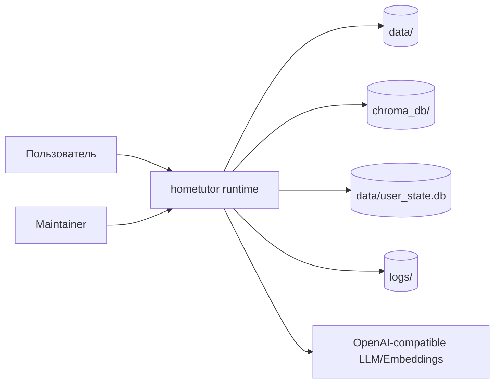
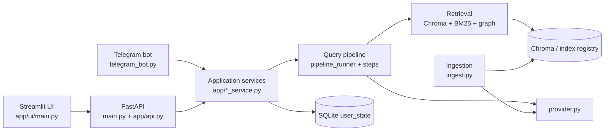
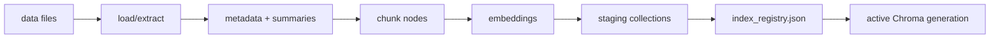
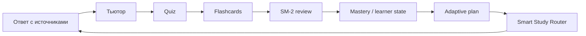

# Архитектура hometutor

Актуализировано по runtime-коду: 2026-07-06.

## Контекст

`hometutor` — локальное учебное RAG-приложение. Оно читает материалы из `data/`, строит индекс, отвечает с источниками, ведёт tutor/quiz/flashcards/progress контур и предлагает следующий шаг через Smart Study Router.

Этот репозиторий — runtime-продукт. В `docs/` живут эксплуатационные runtime-документы и локальная demo-витрина `docs/screenshots/final/`. Документы процесса, backlog, user stories, сценарные манифесты, генератор demo-документа и длинные roadmap-артефакты находятся в `hometutor-studio`.

## System context



## Containers



Ключевая граница: Streamlit ходит в FastAPI через `app/ui_client.py`; Telegram использует service layer; индексация запускается отдельным entrypoint `ingest.py`.

## HTTP application

`app/api.py` собирает FastAPI application:

- middleware: logging, error handling, CORS, optional rate limit;
- lifespan warmups and shutdown cleanup;
- public core/SSR routes;
- protected runtime routes через `require_api_key`, если задан `HOME_RAG_API_KEY`.

Роутеры:

- `core`
- `auth`
- `ssr`
- `query`
- `sessions`
- `knowledge`
- `learner`
- `living-konspekt`
- `feedback`
- `quiz`
- `review`
- `flashcards`
- `dashboard`
- `sync`
- `files`
- `metrics`
- `admin`

Подробная карта: [api_reference.md](api_reference.md). Автогенерируемые диаграммы
(карта API, граф слоёв, ER-схемы SQLite, фичи UI): [diagrams.md](diagrams.md)
(`python scripts/generate_diagrams.py`).

## Аутентификация

Опционально, через флаг `AUTH_ENABLED` (default `false`). Выключенный флаг сохраняет исходное
single-user поведение без изменений — это инвариант, на котором держится обратная совместимость
всех существующих тестов и protected-роутеров.

Модули:

- `app/auth_context.py` — `contextvars`-контекст текущего `user_id`; единственная точка,
  через которую identity попадает в state-слой. Не зависит от config/db (нет циклов импорта).
- `app/auth_db.py` — глобальная SQLite (`data/auth.db`): `users` ← `auth_sessions` ←
  `auth_audit_log` (FK on delete cascade/set null). Реестр пользователей, выданных JWT-сессий
  (для серверного отзыва) и audit-лог регистраций/входов/выходов.
- `app/auth_service.py` — bcrypt-хэширование паролей, выпуск/декод JWT access-токенов.
- `app/auth_models.py` — pydantic-модели запросов/ответов (`EmailStr`, `min_length` для пароля).
- `app/routers/auth.py` — HTTP-слой (`/auth/register|login|me|logout`).
- `app/api_auth.py::auth_scope` — FastAPI dependency: при `AUTH_ENABLED=true` требует валидный
  Bearer JWT, проверяет `auth_db.is_session_revoked(jti)`, ставит `user_id` в `auth_context` на
  время запроса. Подключена ко всем protected-роутерам наравне с `require_api_key`.
- `app/ui/auth_gate.py` — Streamlit login-гейт (формы вход/регистрация), прокидывает токен в
  `app/ui_client.py::_auth_headers` (`Authorization: Bearer ...`) и ставит `auth_context` на
  каждый rerun (`apply_ui_auth_context`).

Per-user изоляция state без переписывания схемы: `app/user_state_db.py::_resolve_state_db_path`
читает текущий `user_id` из `auth_context` и резолвит путь к state-файлу как
`data/users/<user_id>/user_state.db` вместо общего `data/user_state.db`. Кэши schema/pragma в
`user_state_db.py` ключуются по пути файла, поэтому каждый пользовательский файл получает схему
автоматически при первом обращении.

Важный нюанс реализации: `contextvars` не наследуются новым OS-потоком. Tutor chat запускает
`query_service` в worker-потоке (`app/ui/tutor_chat_session.py`) — там контекст явно
прокидывается через `contextvars.copy_context().run(...)`, иначе worker-поток терял бы
`user_id` и писал в общий fallback-путь.

## Query pipeline


Публичный профиль `/ask.profile` резолвится в bounded retrieval settings. Raw retrieval mode остаётся config/debug/admin surface.

Postprocessor chain в `build_query_engine` (`app/retrieval.py`): graph expansion → context
token budget (`app/retrieval_context_budget.py`, opt-in через `RAG_CONTEXT_TOKEN_BUDGET`,
`0` = выключено по умолчанию) → lost-in-middle reorder. Бюджет обязан идти **до** reorder —
иначе он режет relevance-ranked хвост, который reorder только что туда расставил как
высокорелевантный (см. `tests/test_retrieval_context_budget.py`, regression guard на порядок
вызовов). При обрезке постпроцессор режет глубокую копию ноды (`model_copy(deep=True)`), не
мутируя оригинал из retrieval/query-engine кэша.

## Tutor loop

Tutor route — это вариант `/ask`, а не отдельный HTTP endpoint. Он добавляет:

- learner goal snapshot;
- tutor pipeline contract;
- policy/personalization hints;
- optional micro-quiz;
- persisted multi-turn через `session_id`.

Основные модули:

- `app/tutor_orchestrator.py`
- `app/tutor_pipeline_contract.py`
- `app/tutor_learner_contract.py`
- `app/tutor_personalization_policy.py`
- `app/query_tutor_context.py`

## Indexing



Индексация поддерживает full/partial paths, extraction cache, registry activation и graph generation bundles.

Основные модули:

- `app/ingestion.py`
- `app/ingestion_loader.py`
- `app/ingestion_index_full.py`
- `app/ingestion_index_partial.py`
- `app/ingestion_index_nodes.py`
- `app/index_registry.py`
- `app/knowledge_graph_bundle.py`

## Learning loop



`data/user_state.db` — центральное локальное состояние для progress, flashcards, quiz, tutor resume, sync и SSR feedback.

## Smart Study Router

SSR — deterministic-first контур рекомендаций:

- считает локальные сигналы;
- выбирает `hint_kind` и primary navigation;
- строит explainability evidence;
- может обогащать объяснение LLM-слоем;
- пишет feedback локально.

AI/ML компоненты подключаются как gated enrichment/reranking, но базовая маршрутизация остаётся объяснимой и работает без облачного профиля пользователя.

## Multimodal media metadata

M0a/M0.3 мультимодального конспекта добавляют metadata contract и осторожный render в
«Живом конспекте», без VLM, `media_progress` и новых LLM-вызовов. ASR-конвейер M1
(`scripts/transcribe_media.py` → `app/media_alignment.py` → `scripts/build_media_sidecar.py`)
существует как offline maintainer-конвейер с юнит-тестами: приложение его не вызывает,
пакетный запуск — `scripts/Run-MediaKonspektBatch.ps1`.

Выравнивание — `anchor-lis-v3.1` (`app/media_alignment.py`), детерминированное и без LLM:

- **смысловые блоки** — TextTiling-подобная сегментация транскрипта по провалам
  лексической связности; у блока настоящие границы темы (`t_start`/`t_end`) и
  ключевые слова (топ TF-IDF); блоки пишутся в sidecar (`semantic_blocks`) как
  узлы смыслов видео и питают граф-линзу Живого конспекта;
- **канонизация токенов** — RU-стемминг словоформ + транслитерация латинских
  терминов конспекта в кириллицу ASR («skills» ↔ «скиллс»);
- **локальная L1-синонимия** — маленький статический словарь учебных речевых
  паттернов («практическое задание» ↔ «домашка/попробуйте сами/упражнение»)
  расширяет только scoring-токены и только словами, реально найденными в ASR;
- **per-pass хронология** — конспект состоит из нескольких «проходов» по одной
  лекции (H2-группы: слайды → ключевые темы → примеры); LIS-отбор якорей и
  монотонность таймкодов действуют внутри прохода, между проходами — независимы;
- `t_end` раздела — начало следующего раздела прохода, у последнего — конец его
  смыслового блока (не конец медиа).

Ключевые модули:

- `app/media_sidecar.py` — dataclasses, parser/loader и lightweight internal validation
  sidecar v1, включая опциональные `semantic_blocks`;
- `app/media_urls.py` — нормализация внешних video URL, включая YouTube `watch`,
  `youtu.be`, `embed` и timestamp-параметры;
- `app/path_safety.py` — единая проверка persisted `DATA_DIR`-relative paths.
- `app/ui/living_konspekt_view.py` — рабочая поверхность «Живого конспекта»:
  тонкий Streamlit-координатор вкладок, session_state-адаптеры, сохранение и
  artifact lifecycle panel;
- `app/ui/living_konspekt_add_panel.py`, `app/ui/living_konspekt_reader.py`,
  `app/ui/living_konspekt_next_steps.py` — внутреннее добавление разделов,
  режим чтения и next-step панели без раздувания основного view;
- `app/ui/living_konspekt_workbench_panel.py`, `app/workbench_service.py` —
  UI-панель корзины, bulk-операции, persisted/runtime row contract, заметки
  `note` и прогресс чтения `read_at`;
- `app/routers/living_konspekt.py` — protected read-only API status для корзины.

Runtime-конспект может хранить во frontmatter только data-relative указатель:

```yaml
media_sidecar: courses/autonomy/lecture_01/The_Architecture_of_Autonomy.media.json
```

Sidecar `<konspekt>.media.json` лежит внутри `data/` рядом с runtime-конспектом и
является source-of-truth для video source, section timestamps, image assets,
hash invalidation и confidence. `media.video` задаёт основной источник, а
опциональный `media.videos[]` хранит полный список роликов для рендера в UI.
JSON Schema: [schemas/media_sidecar_v1.schema.json](schemas/media_sidecar_v1.schema.json).

Persisted local media paths не могут быть абсолютными, drive-relative или traversal-путями:
они проходят `validate_data_relative_path()` / `resolve_data_relative_path()` и остаются
относительными к `DATA_DIR`. Внешние URL допускаются только как `http(s)`; известные YouTube
формы канонизируются, неизвестные URL остаются обычными external links без timestamp action.

Stale detection работает по `schema_version`, `konspekt_sha256`, `media_sha256`,
`generated_by.asr_model` и `generated_by.alignment_version`. При mismatch потребители должны
переходить в degraded state, а не доверять timestamp evidence. `konspekt_sha256` считается
по содержимому конспекта без собственной строки frontmatter `media_sidecar`, чтобы подключение
sidecar не делало свежие таймкоды устаревшими.

В UI timestamp action показывается только когда sidecar актуален, раздел найден и confidence
не ниже порога. Для stale/low-confidence state остаётся обычная ссылка/предупреждение.

## Storage view

| Store | Владелец | Назначение |
|---|---|---|
| `data/` | пользователь/runtime | исходные материалы |
| `data/**/*.media.json` | `app/media_sidecar.py` | sidecar v1 для multimodal konspekt metadata; только data-relative media paths |
| `data/user_state.db` | `app/user_state*.py` | learner state, cards, SRS, quiz, sync (single-user / `AUTH_ENABLED=false`) |
| `data/users/<user_id>/user_state.db` | `app/user_state_db.py` | per-user state, изоляция при `AUTH_ENABLED=true` |
| `data/auth.db` | `app/auth_db.py` | глобальный реестр пользователей, JWT-сессии, audit-лог |
| `chroma_db/` | Chroma backend | vector index |
| `index_registry.json` | `app/index_registry.py` | active generation pointer |
| `data/graph_generations/` | graph bundle modules | graph artifacts |
| `logs/` | logging/metrics/profiling | runtime logs and profiles |
| `faq_memory.jsonl` | FAQ memory | FAQ cache/memory (миграция в Chroma; `app/faq_memory.py` отключает embedding-вызовы временным circuit breaker'ом при недоступном loopback embedding endpoint) |

## Configuration boundaries

- Runtime settings: `app/config.py`.
- LLM/embeddings: `app/provider.py`.
- Path safety: `app/path_safety.py`.
- Multimodal sidecar and URL safety: `app/media_sidecar.py`, `app/media_urls.py`.
- API contracts: `app/api_models.py`, `app/api_requests.py`, `app/routers/*`.
- UI behavior: `app/ui/main.py` and feature modules under `app/ui/`.

## Deployment

Supported local paths:

- Python venv: `main.py` + `streamlit run app/ui/main.py`.
- Launcher: `scripts/local_start.ps1`.
- Docker: `docker-compose.yml`, plus LM Studio/llama.cpp overlays.

Public demo:

- HF Spaces, **Docker SDK** (`deploy/hf-spaces/`, root `README.md` YAML header: `sdk: docker`,
  `app_port: 8501`). Streamlit SDK не используется, потому что оно не запускает фоновый FastAPI
  процесс, от которого зависит UI; `deploy/docker/docker_entrypoint.sh` поднимает оба процесса
  (uvicorn на `127.0.0.1:8000` внутренний, Streamlit на `0.0.0.0:8501` публичный) и при пустом
  `data/`/`chroma_db/` подкладывает demo-корпус (`deploy/hf-spaces/bootstrap_demo_paths.sh`).
- Контейнерный FS на HF эфемерный: `data/auth.db` и per-user `user_state.db` не персистентны
  между рестартами Space — задокументированное ограничение демо, не баг.

CI/CD (`.github/workflows/`):

- `ci.yml` — `ruff check` + `pytest` на каждый push/PR в `main`.
- `deploy.yml` — после успешного CI пушит в HF Space (`git push --force space HEAD:main`);
  без секретов `HF_TOKEN`/`HF_USERNAME` молча скипает (`exit 0`), не падает.

Аналитика: `app/ui/analytics.py::inject_yandex_metrika()` идемпотентно патчит served
`index.html` Streamlit тегом Яндекс.Метрики, если задан `YANDEX_METRIKA_ID`; без него — no-op
(чистая локалка).

## Architecture rules

- Keep UI thin: business logic belongs in services.
- Keep routers thin: validation, request/response shaping, service calls.
- Read config through `get_settings()` / `get_retrieval_settings()`.
- Build all LLM and embedding clients through `app/provider.py`.
- Access user-state tables through `app/user_state*.py`, not ad hoc SQL in UI/routers.
- Do not add public retrieval modes when a bounded RAG profile is enough.
