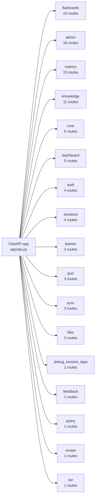
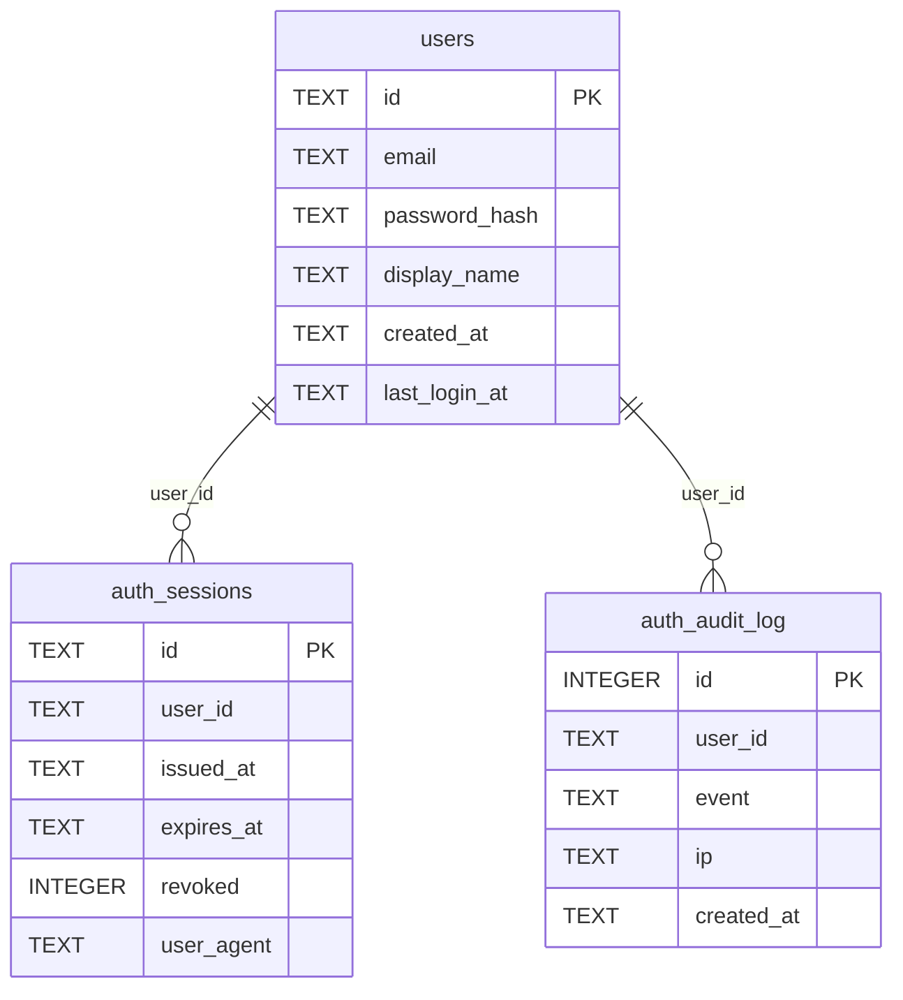
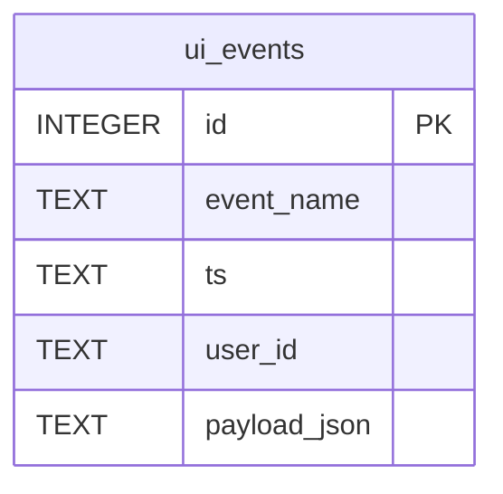
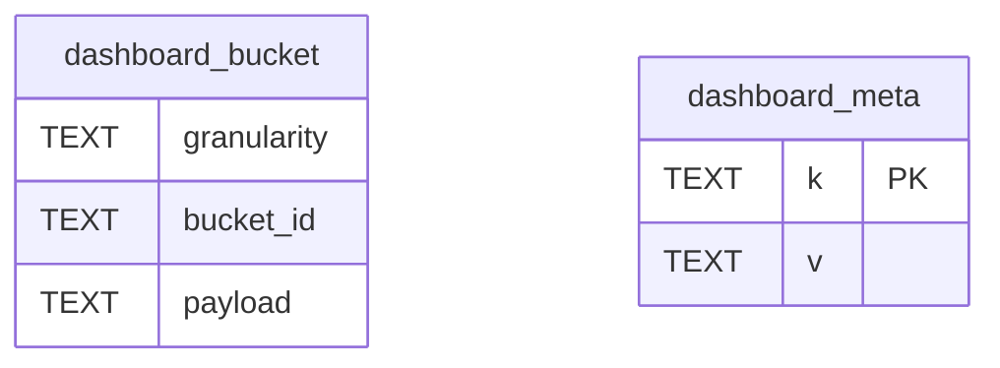
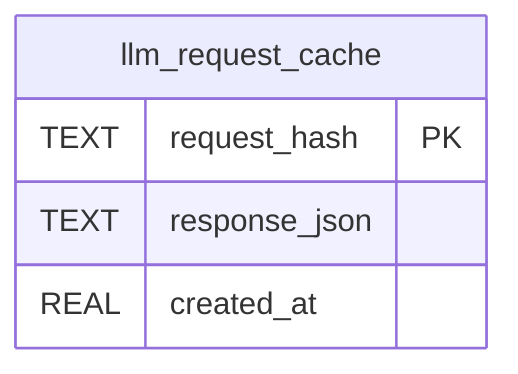
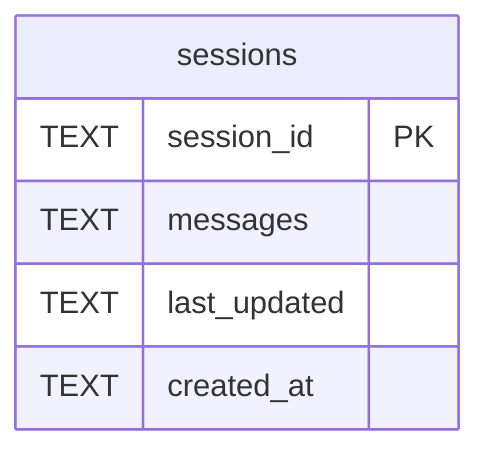

# Диаграммы hometutor (генерируются из кода)

> **НЕ РЕДАКТИРОВАТЬ РУКАМИ.** Файл целиком генерируется скриптом
> `scripts/generate_diagrams.py` из исходников. Обновление:
> `python scripts/generate_diagrams.py`; проверка актуальности: `--check`.
> Концептуальные (рукописные) диаграммы живут в [architecture.md](architecture.md).

## 1. Карта HTTP API

Всего маршрутов: **98** в **17** роутерах (источник: `app/routers/*.py`).



### `admin` (18)

| Метод | Путь |
|---|---|
| GET | `/cache/stats` |
| GET | `/cache/benchmark` |
| POST | `/reindex` |
| GET | `/reindex/status` |
| GET | `/faq/similar` |
| GET | `/index/stats` |
| GET | `/index/version` |
| GET | `/index/diff` |
| GET | `/learner-state/diagnostics` |
| GET | `/learner-state/archive` |
| POST | `/learner-state/archive/restore` |
| POST | `/learner-state/archive/purge` |
| GET | `/cache/answer-flow-stats` |
| POST | `/cache/answer-flow-reset` |
| GET | `/cache/answer-benchmark` |
| GET | `/profile/query` |
| GET | `/profile/compare` |
| GET | `/profile/compare-eval` |

### `auth` (4)

| Метод | Путь |
|---|---|
| POST | `/auth/register` |
| POST | `/auth/login` |
| GET | `/auth/me` |
| POST | `/auth/logout` |

### `core` (6)

| Метод | Путь |
|---|---|
| GET | `/` |
| GET | `/health` |
| GET | `/learner/state/health` |
| GET | `/ui/bootstrap` |
| GET | `/tutor/example` |
| GET | `/health/deep` |

### `dashboard` (5)

| Метод | Путь |
|---|---|
| GET | `/dashboard/mastery` |
| GET | `/dashboard/coach_plan` |
| GET | `/dashboard/adaptive_daily_plan` |
| GET | `/dashboard/analytics` |
| GET | `/dashboard/offline_status` |

### `debug_session_tape` (1)

| Метод | Путь |
|---|---|
| GET | `/debug/session-tape/{session_id}` |

### `feedback` (1)

| Метод | Путь |
|---|---|
| POST | `/ssr/recommendation-feedback` |

### `files` (2)

| Метод | Путь |
|---|---|
| GET | `/explain/file` |
| GET | `/content/file` |

### `flashcards` (19)

| Метод | Путь |
|---|---|
| POST | `/flashcards/generate` |
| POST | `/flashcards/decks` |
| POST | `/flashcards/decks/import-quiz` |
| GET | `/flashcards/bootstrap` |
| GET | `/flashcards/decks` |
| GET | `/flashcards/decks/{deck_id}` |
| GET | `/flashcards/decks/{deck_id}/progress` |
| DELETE | `/flashcards/decks/{deck_id}` |
| GET | `/flashcards/due/count` |
| GET | `/flashcards/due` |
| POST | `/flashcards/due/recovery` |
| GET | `/flashcards/due/schedule` |
| POST | `/flashcards/due/recovery/undo` |
| POST | `/flashcards/review` |
| POST | `/flashcards/review/undo` |
| PUT | `/flashcards/cards/{card_id}` |
| POST | `/flashcards/cards` |
| DELETE | `/flashcards/cards/{card_id}` |
| GET | `/flashcards/decks/{deck_id}/export/anki` |

### `knowledge` (11)

| Метод | Путь |
|---|---|
| GET | `/topics` |
| POST | `/synthesize` |
| POST | `/learning-plan` |
| GET | `/kb/graph/prerequisites-health` |
| GET | `/kb/graph/next-best-actions` |
| GET | `/kb/learner/profile-history` |
| GET | `/kb/learning-plan/graph-bundle` |
| GET | `/kb/source-readiness` |
| GET | `/kb/overview` |
| GET | `/kb/search` |
| GET | `/kb/suggestions` |

### `learner` (3)

| Метод | Путь |
|---|---|
| GET | `/learner/goal-snapshot` |
| PUT | `/learner/goal-snapshot` |
| DELETE | `/learner/goal-snapshot` |

### `metrics` (15)

| Метод | Путь |
|---|---|
| GET | `/metrics` |
| GET | `/metrics/quality` |
| GET | `/metrics/cost` |
| GET | `/metrics/dashboard` |
| GET | `/metrics/learner` |
| GET | `/metrics/educational` |
| GET | `/metrics/mastery-validation` |
| GET | `/metrics/alerts` |
| POST | `/metrics/knowledge-workflow` |
| GET | `/metrics/knowledge-workflow` |
| POST | `/feedback` |
| GET | `/metrics/feedback` |
| GET | `/metrics/store` |
| GET | `/history` |
| GET | `/pipeline/trace` |

### `query` (1)

| Метод | Путь |
|---|---|
| POST | `/ask` |

### `quiz` (3)

| Метод | Путь |
|---|---|
| POST | `/quiz/generate` |
| POST | `/quiz/generate/scoped` |
| POST | `/quiz/evaluate` |

### `review` (1)

| Метод | Путь |
|---|---|
| GET | `/review/due` |

### `sessions` (4)

| Метод | Путь |
|---|---|
| GET | `/sessions` |
| GET | `/sessions/{session_id}` |
| PATCH | `/sessions/{session_id}/metadata` |
| DELETE | `/sessions/{session_id}` |

### `ssr` (1)

| Метод | Путь |
|---|---|
| POST | `/ssr/explain` |

### `sync` (3)

| Метод | Путь |
|---|---|
| GET | `/sync/export` |
| POST | `/sync/import` |
| GET | `/sync/telegram` |

## 2. Граф зависимостей слоёв

Агрегировано по module-level импортам `app/**` (AST). Число на ребре — количество импортов.
Инвариант гвардов: UI не импортируется backend'ом; провайдер и конфиг — стоки.

```mermaid
flowchart TD
    ui["UI (Streamlit)"]
    routers["HTTP routers"]
    apiapp["API app слой"]
    services["Сервисы (домены)"]
    prompts["Промпты"]
    retrieval["Retrieval / Index"]
    graph["Граф знаний"]
    state["State (SQLite)"]
    provider["Провайдер LLM"]
    config["Конфиг"]
    ui -->|102| services
    services -->|58| config
    retrieval -->|39| services
    routers -->|35| services
    routers -->|25| apiapp
    services -->|21| state
    services -->|19| retrieval
    apiapp -->|18| services
    services -->|18| prompts
    apiapp -->|17| routers
    services -->|16| graph
    retrieval -->|13| config
    services -->|13| provider
    ui -->|13| config
    state -->|8| services
    provider -->|7| services
    apiapp -->|6| retrieval
    graph -->|6| services
    routers -->|6| config
    apiapp -->|5| config
    retrieval -->|5| graph
    ui -->|5| state
    retrieval -->|4| provider
    routers -->|4| state
    state -->|3| config
    ui -->|3| provider
    graph -->|2| config
    retrieval -->|2| prompts
    provider -->|2| config
    apiapp -->|1| graph
    apiapp -->|1| provider
    services -->|1| apiapp
    graph -->|1| prompts
    retrieval -->|1| state
    routers -->|1| provider
    ui -->|1| prompts
    ui -->|1| retrieval
```

### Импорты UI из backend-слоёв (включая ленивые)

⚠️ Нарушения границы «backend не знает про UI»:

- `app/rag_runtime_preferences.py:494` → `app.ui.auth_gate`

## 3. Схемы хранилищ (SQLite)

Из `CREATE TABLE` DDL в `app/*.py`. Связи — по `REFERENCES`.

### `auth_db.py` — data/auth.db (3 табл.)



### `event_tracking.py` — см. `app/event_tracking.py` (1 табл.)



### `metrics_db.py` — см. `app/metrics_db.py` (2 табл.)



### `request_cache.py` — см. `app/request_cache.py` (1 табл.)



### `session_store.py` — см. `app/session_store.py` (1 табл.)



### `user_state_db.py` — data/user_state.db (или data/users/<user_id>/…) (18 табл.)

```mermaid
erDiagram
    reading_status {
        INTEGER id PK
        TEXT resource_type
        TEXT resource_id
        INTEGER step_index
        TEXT step_label
        REAL progress
        TEXT display_title
        TEXT index_version
        TEXT updated_at
        RESOURCE_ID) UNIQUE(resource_type,
    }
    annotations {
        INTEGER id PK
        TEXT resource_type
        TEXT resource_id
        TEXT kind
        TEXT body
        TEXT created_at
    }
    research_sessions {
        INTEGER id PK
        TEXT name
        TEXT payload_json
        TEXT index_version
        TEXT created_at
        TEXT updated_at
    }
    quiz_results {
        INTEGER id PK
        TEXT concept
        TEXT level
        REAL score
        TEXT timestamp
        INTEGER attempt_number
        TEXT generation_id
        INTEGER index_version
    }
    spaced_repetition {
        TEXT concept PK
        REAL easiness
        INTEGER interval_days
        INTEGER repetitions
        TEXT next_review
        TEXT last_review
        TEXT generation_id
        INTEGER index_version
    }
    quiz_mastery {
        TEXT concept PK
        TEXT current_level
        INTEGER success_streak
        TEXT last_updated
        TEXT generation_id
        INTEGER index_version
    }
    spaced_repetition_archive {
        INTEGER id PK
        TEXT concept
        REAL easiness
        INTEGER interval_days
        INTEGER repetitions
        TEXT next_review
        TEXT last_review
        TEXT source_generation_id
        INTEGER source_index_version
        TEXT target_generation_id
        INTEGER target_index_version
        TEXT archived_at
        TEXT archived_reason
    }
    quiz_mastery_archive {
        INTEGER id PK
        TEXT concept
        TEXT current_level
        INTEGER success_streak
        TEXT last_updated
        TEXT source_generation_id
        INTEGER source_index_version
        TEXT target_generation_id
        INTEGER target_index_version
        TEXT archived_at
        TEXT archived_reason
    }
    learner_profile_migration_log {
        INTEGER id PK
        TEXT event_type
        TEXT source_generation_id
        INTEGER source_index_version
        TEXT target_generation_id
        INTEGER target_index_version
        TEXT migrated_at
        TEXT archived_counts_json
        TEXT stamped_counts_json
        TEXT live_counts_json
        TEXT diagnostics_json
    }
    micro_quiz_events {
        INTEGER id PK
        TEXT topic
        TEXT feedback_json
        TEXT next_step_json
        TEXT created_at
    }
    tutor_learning_resume {
        INTEGER id PK
        TEXT session_id
        TEXT topic
        TEXT mastery_level
        TEXT last_action_kind
        TEXT last_action_label
        TEXT quiz_feedback_json
        TEXT recommended_next_json
        INTEGER due_reviews_count
        TEXT updated_at
        TEXT index_version
    }
    learner_goal_snapshot {
        INTEGER id PK
        INTEGER schema_version
        TEXT topic
        TEXT subtopic
        TEXT target_level
        TEXT desired_outcome
        INTEGER time_budget_min
        TEXT preferred_style
        TEXT learning_goal
        TEXT updated_at
    }
    flashcard_decks {
        INTEGER id PK
        TEXT name
        TEXT source_type
        TEXT source_id
        INTEGER card_count
        TEXT created_at
        TEXT updated_at
    }
    flashcards {
        INTEGER id PK
        INTEGER deck_id
        TEXT front
        TEXT back
        TEXT tags
        REAL easiness
        INTEGER interval_days
        INTEGER repetitions
        TEXT next_review
        TEXT last_review
        TEXT created_at
        TEXT updated_at
    }
    flashcard_review_log {
        INTEGER id PK
        INTEGER card_id
        INTEGER deck_id
        INTEGER quality
        REAL easiness_before
        REAL easiness_after
        INTEGER interval_before
        INTEGER interval_after
        INTEGER repetitions
        TEXT reviewed_at
    }
    app_kv {
        TEXT key PK
        TEXT value
        TEXT updated_at
    }
    ssr_recommendation_feedback {
        INTEGER id PK
        TEXT action
        TEXT hint_kind
        TEXT primary_nav
        TEXT weak_concept_sha256
        INTEGER why_now_len
        TEXT explanation_outcome
        REAL latency_ms
        TEXT session_key_prefix
        TEXT created_at
    }
    ssr_route_impressions {
        INTEGER id PK
        TEXT hint_kind
        TEXT primary_nav
        TEXT session_key_prefix
        TEXT created_at
    }
    flashcard_decks ||--o{ flashcards : "deck_id"
```

## 4. Фичи UI по уровням опыта

Всего фич: **24** (источник: `app/ui/feature_registry.py::FEATURES`).

```mermaid
flowchart TB
    subgraph T1["Уровень 1"]
        view_mission_control["Главная - Mission Control<br/><i>nav</i>"]
        view_quick_answer["Быстрый ответ с источниками<br/><i>nav</i>"]
        view_search["Поиск по материалам<br/><i>nav</i>"]
        view_explain_file["Объяснить файл<br/><i>nav</i>"]
    end
    subgraph T2["Уровень 2"]
        view_tutor["Чат с тьютором<br/><i>nav</i>"]
        view_quiz["Интерактивный Quiz<br/><i>nav</i>"]
        view_flashcards["Flashcards и повторения<br/><i>nav</i>"]
        view_progress["Прогресс обучения<br/><i>nav</i>"]
        view_topics["Темы и каталог<br/><i>nav</i>"]
    end
    subgraph T3["Уровень 3"]
        view_course["Курс и Course Cockpit<br/><i>nav</i>"]
        view_adaptive_plan["Адаптивный план<br/><i>nav</i>"]
        view_knowledge_graph["Knowledge Graph<br/><i>nav</i>"]
        view_living_konspekt["Живой конспект<br/><i>nav</i>"]
        view_history["История запросов<br/><i>nav</i>"]
        sidebar_research_sessions["Research-сессии<br/><i>sidebar</i>"]
    end
    subgraph T4["Уровень 4"]
        view_metrics["Метрики качества и стоимости<br/><i>nav</i>"]
        view_print["Чистый вид (печать)<br/><i>nav</i>"]
        page_analytics["Страница «Аналитика»<br/><i>page</i>"]
        sidebar_sync_backup["Backup, QR-перенос и восстановление<br/><i>sidebar</i>"]
        sidebar_expert_filters["Фильтры области поиска Q&A<br/><i>sidebar</i>"]
        panel_voice["Голосовой ввод и озвучка<br/><i>panel</i>"]
    end
    subgraph T5["Уровень 5"]
        panel_expert_controls["Экспертные панели в учебных режимах<br/><i>panel</i>"]
        panel_debug_summary["Debug: маршрутизация, trace, стоимость<br/><i>panel</i>"]
        panel_index_freshness["Версия и поколение индекса<br/><i>panel</i>"]
    end
    T1 --> T2
    T2 --> T3
    T3 --> T4
    T4 --> T5
```


