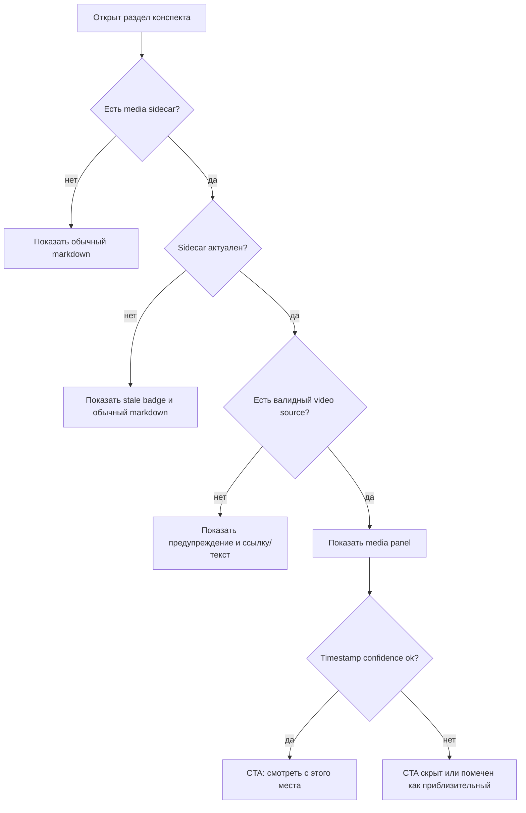

# Мультимодальный конспект: анализ, US/CJM и план «из скучного конспекта — шедевр»

Статус: ТЗ-проработка (handoff-документ, самодостаточный).
Подготовлено: 2026-07-05. Родственные документы: `docs/first_run_experience_plan.md`
(паттерн handoff-плана), `docs/conventions.md`, `docs/conventions_architecture.md`,
`docs/conventions_reference.md`.

Важно: этот документ описывает целевую архитектуру и этапы внедрения. Все места, где требуется
новый контракт, явно помечены как будущие изменения; текущие возможности кода не завышаются.

---

## 1. Суть в трёх абзацах

hometutor сегодня — в основном текстовый продукт: `.txt/.md/.pdf/.html/.docx` на входе,
markdown-конспект на выходе. Но реальный учебный материал студента часто живёт в видеолекциях,
слайдах, схемах и скриншотах. Цель — сделать «Живой конспект», обычные конспекты и активный курс
мультимодальными: видео с безопасной привязкой к конспекту, таймкоды разделов, слайды/картинки
внутри разделов и вопросы прямо по ходу просмотра.

Главная архитектурная находка анализа: базовые швы уже есть, но они не закрывают мультимодальность
сами по себе. `smart_konspekt.gather_lecture_inputs()` уже умеет принимать текстовые транскрипты
как `.txt`, поэтому путь «video → ASR → transcript.txt» может войти в smart-konspekt без изменения
его текстового входного контракта. `section_index.py` уже делает разделы адресуемыми через slug,
диапазон строк и текст раздела, что подходит для последующего выравнивания с таймкодами. Но сами
медиа-ссылки, безопасность путей, sidecar-метаданные, прогресс по видео и vision-слой требуют
новых явных контрактов.

Главный продуктовый принцип: интерактивность — это не «плеер рядом с текстом», а учебный цикл
внутри медиа. Хороший мультимодальный конспект должен вести студента по лестнице:
посмотрел короткий сегмент → ответил на вопрос → объяснил своими словами → получил разбор
тьютора → слабые места ушли в карточки/SSR.

---

## 2. Анализ готовности архитектуры

### 2.1 Что уже готово (швы для встраивания)

| Шов | Где | Что реально даёт мультимодальности |
|---|---|---|
| Контракт входов лекции | `app/smart_konspekt.py::gather_lecture_inputs` — transcripts (`.txt`), drafts (`.md`), html_notes, presentations (`.pdf`) | Транскрипт видео может стать обычным `.txt` и попасть в существующий smart-konspekt путь. Это не решает таймкоды и медиа, но решает первый текстовый слой. |
| Section Anchor Index | `app/section_index.py` — `ParsedSection`/`IndexedSection`: slug, `line_start/end`, `own_text`, скоринг `tokenize_filtered` | Готовая база для адресации разделов и детерминированного матчинга «текст раздела ↔ окно транскрипта». |
| Живой конспект | `app/ui/living_konspekt_view.py`; `study_web_queries.py` уже строит YouTube-ссылки и извлекает ссылки из тел разделов | Естественная поверхность для медиа-панели раздела, но рендер локального видео/картинок ещё нужно проектировать. |
| Obsidian/export path | `app/obsidian_export.py` — YAML-frontmatter, sha256-кэш, map-reduce compose | Можно расширять frontmatter/sidecar, но сейчас media-полей там нет. Нужна совместимая схема, чтобы не ломать существующий markdown. |
| Граница провайдера | `app/provider.py`, `app/provider_openai.py` | Любые будущие VLM-вызовы должны идти через provider-layer. Сейчас vision-фабрики нет; её нужно добавить отдельно с настройками и тестами. |
| Docling/OCR слой | `app/config.py::ingest_docling_enabled`, `app/ingestion.py` | Сейчас это путь к извлечению текста/OCR из документов, не готовый image-asset pipeline. Для слайдов и картинок нужны отдельные артефакты и связи с разделами. |
| Учебный контур | quiz → `flashcard_handoff` → SM-2 → mastery → SSR | Ошибки из video-quiz можно подключить к существующему циклу, но автоматическое создание карточек из video-сегментов требует отдельного UX/контракта. |
| Реестр фич UI | `app/ui/feature_registry.py`, tier'ы | Медиа-фичи можно вводить постепенно, не перегружая новичка. |
| Streamlit primitives | `st.video`, `st.image` | Полезны для MVP, но `start_time`/seek и локальные файлы требуют проверки UX и безопасности путей. |

### 2.2 Чего нет (дефициты)

| Дефицит | Последствие | Как закрывать |
|---|---|---|
| Нет ASR-конвейера приложения | Видео остаётся «слепым» форматом | `scripts/transcribe_media.py` + optional extra `asr` (PyAV декодирует без ffmpeg; ffmpeg — только `--remux`). |
| Нет vision-provider в коде | Слайды/диаграммы не читаются как визуальные объекты | Новая `get_vision_llm()` внутри `app/provider.py`, OpenAI-compatible endpoint, настройки через `get_settings()`. |
| Нет медиа-схемы | Разделы, chunk metadata и user_state не знают про `t_start`, картинки, видео | Sidecar v1 + metadata schema + тесты + sync/export правила. |
| Нет безопасного media path contract | Риск рендера произвольных локальных файлов вне `DATA_DIR` | Только data-relative paths через `app/path_safety.py`; абсолютные пути не хранить в конспекте. |
| Нет progress persistence для видео | Course Cockpit/SSR не понимают просмотренные сегменты | Таблица `media_progress` через `user_state*`, whitelist и sync/import. |
| Quiz/flashcards текстовые | Нет вопросов с таймкодом, image-карточек и video evidence | Расширять генерацию и handoff с preview/подтверждением, без автоспама карточками. |
| Контекст LLM ограничен | Длинный транскрипт не помещается целиком | Использовать существующий map-reduce compose; не пытаться грузить часовую лекцию одним prompt'ом. |

### 2.3 Ограничение сверху

По правилам проекта нельзя превращать мультимодальность в расползание поверхности. Она оправдана только там,
где углубляет существующий цикл «ответ → tutor → quiz → spaced repetition → план». Поэтому:

1. новые модули маленькие;
2. зависимости только optional, если без них нельзя;
3. промпты только в `app/prompts/`;
4. настройки только через `app/config.py`;
5. HTTP-логика только в `app/routers/*`;
6. все пользовательские пути/URL проходят validation/guardrails;
7. каждая фаза должна давать самостоятельную ценность.

### 2.4 Model policy для мультимодальности

План должен учитывать закрытый выбор основной локальной модели проекта: `qwopus3.6-35b-a3b-v1-mtp`.
Для всех текстовых LLM-ролей мультимодальности используется существующий provider-layer и текущий
`LLM_MODEL`/role model из `config.env`, а не новые прямые клиенты и не отдельная cloud-модель.

| Роль в мультимодальности | Модель/механизм | Правило |
|---|---|---|
| Smart-konspekt compose/map-reduce | `qwopus3.6-35b-a3b-v1-mtp` через `get_obsidian_export_llm()` / существующий compose path | Не менять модель ради мультимодальности без отдельной evidence chain. |
| Section enrichment | `qwopus3.6-35b-a3b-v1-mtp` через provider-layer | Промпты только в `app/prompts/`; preview обязателен. |
| In-video quiz questions | `qwopus3.6-35b-a3b-v1-mtp` через `get_quiz_llm()` | `QUIZ_LLM_MODEL` по умолчанию совпадает с `LLM_MODEL`; не грузить вторую local text model. |
| Tutor/self-explanation review | `qwopus3.6-35b-a3b-v1-mtp` через `get_llm()` / tutor path | Local-first; cloud fallback только по уже существующим consent rules. |
| Graph/concept enrichment | `qwopus3.6-35b-a3b-v1-mtp` через `get_graph_llm()` | Использовать текущий graph role, не вводить новый graph LLM. |
| SSR video hints | `qwopus3.6-35b-a3b-v1-mtp` через `get_ssr_llm_resolved()` при LLM-нужде; rule-only где возможно | SSR evidence должен быть детерминированным; LLM только для объяснения. |
| Retrieval по transcript/captions | `text-embedding-qwen3-embedding-0.6b` | Captions-as-text сначала идут в существующий BM25/vector индекс. |
| Раздел ↔ таймкод | Без LLM | Детерминированный alignment по `section_index.py`/tokens; Qwopus не нужен. |
| ASR | `faster-whisper` optional extra | Это не LLM и не замена Qwopus; отдельный backend для audio→text. |
| Vision captions | Будущая VLM через `get_vision_llm()` | Исключение из single text model policy, потому что Qwopus не vision-модель. |

Acceptance criteria для любой задачи M1+ с LLM:

- в коде нет прямого создания OpenAI/LM Studio клиентов вне `app/provider.py`;
- если задача текстовая, effective model по умолчанию остаётся `qwopus3.6-35b-a3b-v1-mtp`;
- если задача использует embeddings, effective embedding model остаётся `text-embedding-qwen3-embedding-0.6b`;
- если задача требует ASR/VLM, документировать это как отдельную роль, а не как замену основной LLM;
- tests/diagnostics должны проверять routing на provider-layer, а не конкретный cloud endpoint.

---

## 3. Контракты данных до ASR/VLM

### 3.1 Источник медиа

Для локальных медиа нельзя хранить абсолютные пути вроде
`C:\Users\...\The_Architecture_of_Autonomy.mp4`. Источник видео хранится в sidecar, не в теле
markdown. Целевой контракт внутри `<konspekt>.media.json`:

```yaml
media:
  video:
    kind: local
    title: The Architecture of Autonomy
    path: courses/autonomy/lecture_01/The_Architecture_of_Autonomy.mp4
    sha256: "..."
  videos:
    - kind: local
      title: The Architecture of Autonomy
      path: courses/autonomy/lecture_01/The_Architecture_of_Autonomy.mp4
      sha256: "..."
    - kind: url
      title: External reference
      url: "https://www.youtube.com/watch?v=..."
```

Где `path` — путь относительно `DATA_DIR`, валидируемый через `app/path_safety.py`.
Для внешнего видео:

```yaml
media:
  video:
    kind: url
    url: "https://www.youtube.com/watch?v=..."
```

URL должен проходить нормализацию: `youtube.com/watch`, `youtu.be`, `embed`, query params, `t=`,
и мягкую деградацию для неизвестных хостов. Для локального видео UI не должен получать произвольный
абсолютный путь.

### 3.2 Sidecar v1

Чтобы не ломать markdown-парсинг и текущий frontmatter, первый контракт лучше вынести в sidecar.
Проверяемая JSON Schema: `docs/schemas/media_sidecar_v1.schema.json`.

```json
{
  "schema_version": 1,
  "konspekt_sha256": "...",
  "media_sha256": "...",
  "generated_by": {
    "tool": "transcribe_media",
    "asr_model": "faster-whisper-large-v3",
    "created_at": "2026-07-05T00:00:00Z"
  },
  "media": {
    "video": {
      "kind": "local",
      "title": "The Architecture of Autonomy",
      "path": "courses/autonomy/lecture_01/The_Architecture_of_Autonomy.mp4",
      "sha256": "..."
    },
    "videos": [
      {
        "kind": "local",
        "title": "The Architecture of Autonomy",
        "path": "courses/autonomy/lecture_01/The_Architecture_of_Autonomy.mp4",
        "sha256": "..."
      },
      {
        "kind": "url",
        "title": "External reference",
        "url": "https://www.youtube.com/watch?v=..."
      }
    ]
  },
  "sections": [
    {
      "section_id": "sha256:...",
      "section_slug": "architecture-of-autonomy",
      "heading": "Architecture of Autonomy",
      "line_start": 12,
      "line_end": 58,
      "t_start": 734.2,
      "t_end": 1091.4,
      "confidence": 0.82,
      "images": []
    }
  ]
}
```

`section_slug` удобен для UI, но не должен быть единственным ключом: slug меняется при переименовании,
переводе заголовка или регенерации. Нужен стабильный `section_id`, например hash от нормализованного
heading + own_text + source metadata.

### 3.3 Размещение sidecar и frontmatter v1

Решение для первой реализации:

- runtime sidecar лежит рядом с runtime-конспектом в `DATA_DIR`;
- имя sidecar: `<konspekt_stem>.media.json`;
- frontmatter конспекта хранит только указатель на sidecar, а не дублирует video metadata;
- source-of-truth для video source, timestamps и images — sidecar;
- если markdown-файл открыт вне `DATA_DIR`, media отключается до явного import в `DATA_DIR`.

Frontmatter v1:

```yaml
media_sidecar: courses/autonomy/lecture_01/The_Architecture_of_Autonomy.media.json
```

Sidecar path во frontmatter тоже `DATA_DIR`-relative и проходит тот же path-safety слой.
Это намеренно скучный контракт: меньше дублирования, проще invalidation, меньше риск рассинхронизации
между markdown и sidecar.

### 3.4 Invalidation

Sidecar считается устаревшим, если изменился хотя бы один из факторов:

- sha256 конспекта;
- sha256 видео/аудио;
- версия ASR-модели;
- параметры сегментации/VAD;
- алгоритм section alignment;
- версия sidecar-схемы.

UI должен показывать устаревшие таймкоды как degraded state, а не молча доверять им.

### 3.5 Sync, privacy и lifecycle

`data/` уже находится вне git. Это не заменяет lifecycle:

- медиа-хранилище должно иметь retention/cleanup для orphaned assets;
- `media_progress` должен попадать в user-state sync/export/import;
- при включённой auth-модели нужно решить владение медиа: global course media, per-user media или shared-by-course;
- все таблицы и колонки user-state добавляются только через существующий `user_state*` слой и whitelist;
- экспорт курса должен различать: markdown, sidecar metadata, progress state и тяжёлые бинарные медиа.

---

## 4. Транскрибация видео: оптимальное решение

### 4.1 Сравнение вариантов (локально, RU+EN лекции, GPU)

| Вариант | Сильные стороны | Риски/ограничения | Вердикт |
|---|---|---|---|
| **faster-whisper (large-v3 / turbo)** | Хорошее качество на RU/EN, word/segment timestamps, VAD, Python API, удобная интеграция в `scripts/` | Нужны optional dependency, CUDA-совместимость, модельный кэш, ffmpeg | Рекомендация для первого ASR-конвейера. |
| whisper.cpp | Минимум Python-зависимостей, внешний бинарь, можно запускать очень локально | Нужно управлять бинарём/моделями отдельно, сложнее интеграция в Python workflow | Запасной путь, если CUDA/Python stack окажется неудобным. |
| NVIDIA Parakeet/NeMo class models | Очень высокая скорость в подходящих сценариях | Тяжёлый стек, качество на смешанной RU/EN речи и терминах надо валидировать локально | Кандидат на будущую оптимизацию, не MVP. |
| Cloud ASR | Быстро, удобно, меньше локальных зависимостей | Против local-first по умолчанию; приватность и стоимость | Только явный opt-in. |

Точные speed/WER обещания нельзя фиксировать в ТЗ без локального benchmark на целевой машине и целевых лекциях.
Для первой реализации метрика качества должна быть практической: timestamp coverage, читаемость transcript,
ручная проверка 5-10 сегментов и время обработки на одном часовом видео.

### 4.2 Рекомендуемый конвейер

```text
video.mp4
  → path validation: файл находится внутри DATA_DIR или импортируется туда
  → ffmpeg: extract audio (16 kHz mono wav)          [системная зависимость, preflight]
  → faster-whisper large-v3/turbo (CUDA, VAD, timestamps)
  → артефакты рядом с видео или в course media dir:
      lecture.txt            — чистый транскрипт → smart_konspekt как обычный .txt
      lecture.segments.json  — [{start, end, text}] → выравнивание разделов по времени
  → smart_konspekt compose
  → post-hoc alignment → <konspekt>.media.json
```

Пример для файла из задачи:

```powershell
.\.venv\Scripts\python.exe scripts\transcribe_media.py `
  "C:\Users\Kostya\Downloads\The_Architecture_of_Autonomy.mp4" `
  --import-to-data "courses\autonomy\lecture_01" --language auto --model large-v3
```

Ожидаемые артефакты после импорта в `DATA_DIR`:

```text
data/courses/autonomy/lecture_01/The_Architecture_of_Autonomy.mp4
data/courses/autonomy/lecture_01/The_Architecture_of_Autonomy.txt
data/courses/autonomy/lecture_01/The_Architecture_of_Autonomy.segments.json
```

Важно: если транскрипт должен попасть в общий retrieval index, он должен лежать в индексируемом `DATA_DIR`
или быть явно импортирован туда. Генерация `.txt` в произвольной внешней папке не делает его частью RAG.

### 4.3 Выравнивание «раздел ↔ таймкод»

Два уровня, от простого к точному:

1. **Compose-time hints:** в map-фазе каждому chunk'у транскрипта можно передавать временное окно;
   промпт просит сохранять временные маркеры у заголовков. Это требует изменения prompt source
   только в `app/prompts/`.
2. **Post-hoc alignment без LLM:** `own_text` раздела сравнивается с окнами `segments.json` через
   детерминированный токенный скоринг, близкий к уже существующему `section_index.py`. Результат
   пишется в sidecar v1 с `confidence`.

MVP должен начинаться с post-hoc alignment: его легче тестировать, легче инвалидировать и он не зависит
от поведения LLM.

**Статус реализации (2026-07-06): M1 partially prototyped, not production-ready.**
Конвейер §4.2–4.3 существует как offline maintainer-скрипты с юнит-тестами; приложение их
не вызывает, benchmark-spike из ADR 0002 не проведён.

- `scripts/transcribe_media.py` — ASR через faster-whisper (**только** extra `asr`, не в
  requirements.txt — ADR 0002); аудио декодируется из медиафайла напрямую (PyAV), системный
  ffmpeg нужен только для `--remux` (`.ts` → браузерный `.mp4` без перекодирования);
  `--import-to-data <rel-dir>` копирует внешний файл в `DATA_DIR` (файл вне `DATA_DIR` без
  импорта — явное предупреждение); идемпотентность по sha256 медиа + полному fingerprint
  ASR-параметров (model, language, beam_size, VAD, schema); пишет `<stem>.segments.json`
  (segment-level таймкоды; word-level в M1 сознательно не сохраняются) + `<stem>.txt`.
- `app/media_alignment.py` — post-hoc выравнивание `anchor-lis-v1`: IDF-фильтр фоновой
  лексики → блочный токенный скоринг (`tokenize_filtered`) → взвешенный LIS (гарантия
  хронологии) → уточнение `t_start` до сегмента → интерполяция промежуточных разделов с
  confidence < 0.70; стабильный `section_id` (контент-хэш) — первичный ключ матчинга в UI,
  позиционный матчинг остаётся fallback. Тесты: `tests/test_media_alignment.py` (включая
  регрессию на общую повторяющуюся лексику тем), `tests/test_media_section_matching.py`.
- `scripts/build_media_sidecar.py` — собирает/обновляет `<konspekt>.media.json` (schema v1);
  конспект принимается только внутри `DATA_DIR`; `segments.media_sha256` сверяется с реальным
  sha256 видео (несовпадение — отказ с инструкцией); сохраняет существующие `media.videos`
  (в т.ч. YouTube) и картинки разделов (ключ — `section_id`, fallback — slug+line);
  валидация контракта `parse_media_sidecar` до записи; `--dry-run` показывает покрытие.

Не сделано (границы прототипа): benchmark-spike (никаких обещаний скорости/качества до него),
ручная проверка `st.video(start_time=…)` на реальном mp4, качество выравнивания на реальной
4–5-часовой лекции (тесты синтетические, хоть и с повторяющейся лексикой), compose-time hints
(§4.3 п.1), runtime-интеграция (`ASR_ENABLED`, вызовы из приложения).

### 4.4 Минимальный путь (MVP-0, без ASR)

Если видео лежит на YouTube или студент пока не хочет транскрибировать его, достаточно безопасной ссылки
на видео в frontmatter/sidecar и рендера в «Живом конспекте».

Acceptance boundary для MVP-0:

- локальные файлы только внутри `DATA_DIR`;
- абсолютный путь можно принять только на этапе import, после чего он копируется/перемещается в `DATA_DIR`
  и в metadata сохраняется relative path;
- YouTube-ссылки нормализуются через URL parser;
- битый путь или недоступный URL превращается в текстовую ссылку/предупреждение, а не в падение UI.

### 4.5 Vision-слой (слайды и картинки)

Vision нужно вводить как отдельную фазу после ASR/MVP-0:

- **Модель:** Qwen-VL class model через LM Studio/OpenAI-compatible endpoint — кандидат, но не текущая
  возможность приложения.
- **Кодовый контракт:** новая `get_vision_llm()` в `app/provider.py`, настройки через `app/config.py`,
  adapter tests в стиле существующего provider-layer.
- **Источники картинок:** страницы PDF-презентаций, keyframes видео, вложенные изображения markdown/html.
- **Артефакты:** image files в controlled media dir + captions/alt-text в sidecar.
- **Retrieval:** сначала индексировать текстовые подписи через существующий BM25/vector, не строить вторую
  multimodal embedding-инфраструктуру.

Если `pymupdf` уже есть в runtime dependencies, это не означает, что image pipeline бесплатен: нужны storage,
cleanup, linking, tests и UI.

---

## 5. Что действительно работает в обучении

Ниже — стабильные методологические принципы, которые хорошо согласуются с текущим ядром hometutor.
Документ избегает неподтверждённых точных чисел и ссылок на непроверенные исследования.

| Принцип | Почему важен | Как применяем |
|---|---|---|
| **Retrieval practice внутри просмотра** | Вопросы по ходу материала удерживают активное вспоминание, а не пассивное потребление. | Вопрос после короткого сегмента, на границе раздела. Ошибка может стать кандидатом в карточку через preview/handoff. |
| **Сегментация короткими блоками** | Короткие смысловые блоки снижают когнитивную нагрузку и поддерживают self-pacing. | «Видео-сегмент дня» в Course Cockpit; разделы конспекта становятся главами видео. |
| **Dual coding** | Слова + визуальные опоры помогают строить более прочные mental models, если изображение связано с сутью. | Слайд/диаграмма рядом с релевантным разделом, image-card только для реальных схем/процессов. |
| **Signaling + coherence** | Подсветка важного помогает; декоративные картинки и визуальный шум вредят. | «Шедевр» = ясность, структура, схема, пример; не стоковые картинки и не украшательство. |
| **Self-explanation** | Объяснение своими словами переводит просмотр в генеративное обучение. | После 2-3 сегментов тьютор просит коротко объяснить идею и разбирает пробелы. |
| **ICAP-лестница** | Интерактивный и конструктивный режимы сильнее пассивного просмотра. | UI ведёт: смотрю → отвечаю → объясняю → обсуждаю с тьютором → повторяю слабое. |

Анти-паттерны:

- вопросы только в самом конце длинного видео;
- автоплей без пауз на осмысление;
- декоративные иллюстрации;
- дословное дублирование большого текста голосом/экраном;
- автоматическое создание десятков карточек без preview и дедупликации.

---

## 6. User Stories (по эпикам, с acceptance criteria)

### Epic M0 — «Видео живёт в конспекте» (MVP, без новых зависимостей)

**US-M0.1.** Как студент, я хочу безопасно привязать YouTube-URL или локальное видео к конспекту,
чтобы конспект знал свой первоисточник.

*AC:*
- frontmatter хранит только `media_sidecar`;
- sidecar хранит `media.video.kind` и сам основной video source; опциональный
  `media.videos[]` хранит полный список роликов для UI;
- локальное видео хранится только как `DATA_DIR`-relative path;
- абсолютный путь допустим только как import input, не как persisted metadata;
- UI показывает плеер/ссылку;
- битый путь мягко деградирует в предупреждение.

**US-M0.2.** Как студент, я хочу видеть в разделе кнопку «смотреть с этого места»,
если у раздела есть валидный таймкод.

*AC:*
- таймкоды берутся из sidecar v1;
- YouTube timestamp строится URL parser'ом;
- для локального видео проверено поведение `st.video(start_time=...)` (ручная проверка; на 2026-07-06 ещё не выполнена);
- если Streamlit seek UX плохой, MVP показывает отдельные timestamp-ссылки/перерендер без обещания плавного seek.

### Epic M1 — «Видео как источник» (ASR-конвейер)

**US-M1.1.** Как студент, я хочу импортировать видеолекцию в `DATA_DIR` и одной командой получить транскрипт,
чтобы собрать конспект как обычно.

*AC:*
- `scripts/transcribe_media.py` принимает mp4/mkv/mp3/wav;
- проверяет/импортирует файл внутрь `DATA_DIR`;
- создаёт `.txt` + `.segments.json`;
- идемпотентен по sha256;
- работает offline;
- отсутствие ffmpeg или ASR-extra даёт понятную ошибку;
- `.txt` подхватывается smart-konspekt как обычный transcript.

**US-M1.2.** Как студент, я хочу, чтобы разделы сгенерированного конспекта автоматически получили таймкоды.

*AC:*
- post-hoc alignment `own_text` ↔ `segments.json`;
- sidecar содержит `section_id`, `t_start`, `t_end`, `confidence`;
- есть degraded state для low-confidence alignment;
- регрессионный тест проверяет детерминированность.

**US-M1.3.** Как студент, я хочу, чтобы транскрипт попал в общий индекс,
чтобы «Быстрый ответ» находил сказанное в видео и показывал минуту.

*AC:*
- transcript лежит в индексируемом `DATA_DIR`;
- chunk metadata может хранить `media_id`/`t_start` через явно добавленный контракт;
- source card показывает timestamp только если metadata валидна;
- обычные текстовые источники не ломаются.

### Epic M2 — «Раздел-шедевр» (обогащение)

**US-M2.1.** Как студент, я хочу видеть слайды презентации внутри соответствующих разделов конспекта.

*AC:*
- PDF/slide extraction создаёт image assets в controlled media dir;
- image paths data-relative;
- связь slide ↔ section хранится в sidecar;
- UI рендерит `st.image` только после path validation;
- отсутствие слайда не ломает раздел.

**US-M2.2.** Как студент, я хочу кнопку «Обогатить раздел»,
чтобы скучный текст превратился в ясное объяснение с диаграммой, аналогией и примером.

*AC:*
- промпт находится в `app/prompts/`;
- результат идёт через preview принять/отклонить;
- генерируются mermaid-схема, аналогия, пример, термины;
- coherence-правило запрещает декоративное обогащение;
- изменения не пишутся в markdown без явного подтверждения.

**US-M2.3.** Как студент, я хочу, чтобы диаграммы и скриншоты имели текстовые подписи,
чтобы поиск находил «ту самую схему».

*AC:*
- captions создаются через `get_vision_llm()`;
- подпись индексируется как текст;
- model/provider errors мягко деградируют;
- VLM-фича выключена настройкой до стабилизации.

### Epic M3 — «Интерактивный просмотр»

**US-M3.1.** Как студент, я хочу получать один вопрос после короткого видео-сегмента,
чтобы проверять понимание сразу.

*AC:*
- вопрос генерируется из transcript window, а не из всей лекции;
- частота не чаще 1 вопроса на 5-7 минут или на смысловой раздел;
- ошибка создаёт candidate flashcard через preview/handoff;
- есть дедупликация похожих карточек.

**US-M3.2.** Как студент, я хочу после блока сегментов объяснить тему своими словами и получить разбор.

*AC:*
- self-explanation prompt живёт в `app/prompts/`;
- tutor assessment пишет слабые места в существующий learner state только через разрешённые user_state helpers;
- короткий ответ не штрафуется за стиль, оценивается понимание.

**US-M3.3.** Как студент, я хочу, чтобы приложение помнило просмотренные/проверенные сегменты.

*AC:*
- таблица `media_progress` добавлена через `user_state*` schema/migration;
- таблица входит в sync/export/import whitelist;
- статусы: `unwatched`, `watched`, `verified`;
- auth/per-user изоляция проверена тестами.

### Epic M4 — «Курс-плеер» (активный курс)

**US-M4.1.** Как студент на активном курсе, я хочу получать «видео-сегмент дня» в ротации Course Cockpit.

*AC:*
- текущий `cockpit_rotator` сначала дорабатывается от stub/каркаса до реального слота;
- сегмент выбирается по плану курса, mastery и `media_progress`;
- сегмент запускается за 1-2 клика;
- если Course Cockpit выключен/недоступен, фича не влияет на обычный конспект.

**US-M4.2.** Как студент, я хочу, чтобы SSR при слабом mastery темы рекомендовал пересмотреть конкретный сегмент.

*AC:*
- `hint_kind=video_segment` добавляется в Literal/типовой контракт recommendation layer;
- evidence содержит тему, segment id и timestamp;
- без валидного media alignment SSR не создаёт video hint;
- рекомендация не заменяет карточки, а дополняет их.

---

## 7. Customer Journey Maps

### CJM-1: «Из видеолекции — в шедевр-конспект» (раз в лекцию)

| Стадия | Действие студента | Точка контакта | Эмоция сейчас → цель | Барьер | Метрика успеха |
|---|---|---|---|---|---|
| 1. Импорт | Выбирает `The_Architecture_of_Autonomy.mp4` и импортирует в курс внутри `DATA_DIR` | CLI / будущий Mission Control action | «опять час смотреть» → «материал станет учебным объектом» | файл вне data → import с понятной подсказкой | media path стал data-relative |
| 2. Транскрибация | Запускает одну команду | `scripts/transcribe_media.py` | ожидание → «появился текст и сегменты» | нет ffmpeg/extra → preflight | `.txt` + `.segments.json` созданы |
| 3. Конспект | Запускает обычный smart-konspekt | существующий конвейер | привычно | длинный transcript → map-reduce | конспект создан |
| 4. Таймкоды | Запускается alignment | sidecar v1 | «где это было?» → «каждый раздел связан с видео» | low confidence | ≥80% ключевых разделов имеют уверенный таймкод на тестовой лекции |
| 5. Обогащение | Принимает 1-3 улучшения разделов | Живой конспект preview | «сухой текст» → «ясное объяснение со схемой» | визуальный шум | приняты полезные улучшения, отклонён декор |
| 6. Учёба | Отвечает на вопросы, слабые места уходят в cards/SSR | quiz/tutor/flashcards | «конспект лежит мёртвым» → «конспект ведёт меня» | автоспам карточек | карточки создаются через preview |

### CJM-2: «Ежедневная сессия с интерактивным видео»

| Стадия | Действие | Точка контакта | Эмоция → цель | Барьер | Метрика |
|---|---|---|---|---|---|
| 1. Вход | Открывает Course Cockpit или Живой конспект | «видео-сегмент дня» / раздел с таймкодом | «с чего начать» → «один понятный шаг» | cockpit не готов | fallback через Живой конспект |
| 2. Просмотр | Смотрит короткий сегмент с релевантным текстом рядом | video + section text | пассивность → dual coding | seek UX | сегмент открыт без ручного поиска |
| 3. Вопрос | Отвечает на 1 вопрос по сегменту | interpolated quiz | «просто посмотрел» → «проверил себя» | вопрос общий | вопрос связан с текущим окном transcript |
| 4. Объяснение | Пишет 2-3 предложения своими словами | tutor-контур | «вроде понял» → «могу сформулировать» | длинный ввод | короткий ответ принят |
| 5. Следующий шаг | Получает cards / следующий сегмент / пересмотр слабого места | SSR | «что дальше?» → «система ведёт» | нет alignment | fallback на обычные cards/quiz |

---

## 8. Фазировка

| Фаза | Состав | Новые зависимости | Оценка | Ценность |
|---|---|---|---|---|
| **0** | Safe media metadata, frontmatter/sidecar v1, плеер/ссылка в Живом конспекте | нет | 1-2 дня | видео связано с конспектом без ASR |
| **1** | `transcribe_media.py`, import-to-data, `.txt` + `.segments.json`, post-hoc alignment | optional extra `asr`; ffmpeg — только для `--remux` | ~1 неделя | видео становится текстовым источником и получает таймкоды |
| **2** | slide/image assets, section enrichment preview, segment quiz | возможно reuse existing deps; новые deps только после проверки | ~2 недели | конспект становится учебной поверхностью, а не markdown-файлом |
| **3** | VLM captions, self-explanation, `media_progress`, Course Cockpit slot, SSR video hint | LM Studio/Qwen-VL class endpoint, без прямого клиента вне provider-layer | ~2-3 недели | полный мультимодальный учебный цикл |

Runtime-настройки нужны только там, где есть реальная внешняя зависимость или риск: `ASR_ENABLED`,
`VISION_CAPTIONS_ENABLED`, `MEDIA_PROGRESS_ENABLED`. Не вводить переключатели ради каждого UI-элемента.

Пользовательский инвентарь локальных моделей (внешний артефакт, не часть runtime-репозитория) стоит обновить
после принятия решения: добавить ASR-кандидат, VLM-кандидат, требования к VRAM, скорость на тестовом видео
и фактические ограничения.

---

## 9. Implementable backlog

Этот раздел нарезает план на задачи, которые можно отдавать в разработку с узким write-set.
Backlog/user stories как процессный источник истины живут в `hometutor-studio`; здесь — runtime handoff.

### Первый dev-slice: M0a

Начинать с `M0a`, а не с ASR и не с UI:

**Статус runtime:** реализован 2026-07-05; расширен 2026-07-06 поддержкой
`media.videos[]` и optional `title` у video source. Добавлены `app/media_sidecar.py`,
`app/media_urls.py`, усилена проверка persisted `DATA_DIR`-relative путей в
`app/path_safety.py`, добавлены focused tests. JSON Schema остаётся публичным
контрактом; runtime использует lightweight internal validation без новой зависимости.

**Цель:** сделать проверяемый контракт sidecar + безопасное чтение media pointer.

**Точный write-set:**
- `app/media_sidecar.py` — dataclasses/parser/validator для sidecar v1;
- `app/media_urls.py` — normalizer для YouTube/URL timestamp links;
- `app/path_safety.py` — только если текущих helpers не хватает для media relative path;
- `tests/test_media_sidecar.py`;
- `tests/test_media_urls.py`;
- `docs/schemas/media_sidecar_v1.schema.json`;
- `docs/multimodal_konspekt_plan.md`;
- `docs/adr/0001-multimodal-media-contract.md`.

**Не входит в M0a:** Streamlit UI, ASR, VLM, `media_progress`, ingestion metadata, source cards.
M0a не вызывает LLM; `qwopus3.6-35b-a3b-v1-mtp` не должен загружаться или дергаться для чтения sidecar.

**Готовность M0a:** выполнено. JSON Schema validator не добавлялся в dependencies:
M0a использует lightweight internal validation, а JSON Schema остаётся проверяемым
публичным контрактом до отдельного решения о dependency.

### M0.1 Media metadata parser

**Цель:** прочитать media metadata из frontmatter/sidecar без изменения существующего markdown-парсинга.

**Write-set:** `app/media_sidecar.py`, `tests/test_media_sidecar.py`,
`docs/schemas/media_sidecar_v1.schema.json`.

**DoD:**
- локальный media path хранится только как `DATA_DIR`-relative;
- sidecar v1 валидируется по schema;
- stale sidecar определяется по hash/version;
- обычный конспект без media работает как раньше.

### M0.2 Media path and URL safety

**Цель:** единый validator для локальных media paths и внешних video URL.

**Write-set:** `app/media_urls.py`, `app/path_safety.py` только при нехватке текущих helpers,
`tests/test_media_urls.py`, targeted path-safety tests.

**DoD:**
- path traversal и абсолютный persisted path отклоняются;
- внешний absolute path допустим только как import input;
- YouTube URL normalizer покрывает `watch`, `youtu.be`, `embed`, существующие query params и `t=`;
- неизвестный URL рендерится только как обычная ссылка.

### M0.3 Living Konspekt media panel

**Цель:** показать видео/ссылку и timestamp action в «Живом конспекте».

**Статус runtime:** реализован 2026-07-05; расширен 2026-07-06 для рендера
нескольких источников из `media.videos[]`. `app/ui/living_konspekt_view.py`
читает sidecar через `app/media_sidecar.py`, матчится на section row, показывает
YouTube timestamp action или локальное `st.video(...)` после path-safety. Stale и
low-confidence states деградируют без уверенной timestamp-кнопки.

**Write-set:** `app/ui/living_konspekt_view.py`, возможный маленький UI helper, UI smoke tests.

**DoD:**
- нет падения без sidecar;
- stale/low-confidence timestamp показывается как degraded state;
- `st.video(start_time=...)` проверен вручную на локальном mp4 (на 2026-07-06 ещё не выполнено);
- при плохом seek UX используется timestamp-link fallback.

### M1.1 ASR import script

**Цель:** импортировать видео в `DATA_DIR` и создать `.txt` + `.segments.json`.

**Write-set:** `scripts/transcribe_media.py`, `pyproject.toml` optional extra, focused tests/docs.

**DoD:**
- команда использует `.\.venv\Scripts\python.exe`;
- отсутствующий ASR-extra даёт понятную ошибку с командой установки; отсутствующий ffmpeg
  влияет только на `--remux` (пропуск с инструкцией);
- sha256 медиа + fingerprint ASR-параметров делают запуск идемпотентным;
- transcript оказывается в индексируемом `DATA_DIR` (файл вне `DATA_DIR` без
  `--import-to-data` — отказ, обход только через явный `--allow-external-output`);
- внешнее видео не остаётся persisted absolute path.

### M1.2 Section timestamp alignment

**Цель:** сопоставить sections из `section_index.py` с окнами transcript segments без LLM.

**Write-set:** `app/media_alignment.py`, tests, sidecar docs/schema if needed.

**DoD:**
- алгоритм детерминирован;
- confidence попадает в sidecar;
- low-confidence sections не получают уверенного CTA;
- duplicate/renamed slugs не ломают mapping благодаря `section_id`.

### M1.3 Timestamped source cards

**Цель:** показывать минуту видео в ответах только при валидной chunk metadata.

**Write-set:** ingestion metadata path, source card renderer, focused retrieval/source tests.

**DoD:**
- обычные документы без `t_start` не меняют поведение;
- timestamp не показывается при stale sidecar;
- источник ведёт к безопасному media URL/path.

### M2.1 Slide/image asset pipeline

**Цель:** извлекать реальные slide/image assets и связывать их с разделами.

**Write-set:** media asset helper, sidecar image entries, UI image render, cleanup docs.

**DoD:**
- все image paths data-relative;
- orphan cleanup описан;
- image render проходит path validation;
- отсутствие VLM не блокирует базовый slide render.

### M2.2 Section enrichment preview

**Цель:** сделать «обогатить раздел» через preview, без прямой перезаписи markdown.

**Write-set:** `app/prompts/`, UI preview helper, tests around prompt registry/preview state.

**DoD:**
- prompt source-of-truth находится в `app/prompts/`;
- effective text model по умолчанию — `qwopus3.6-35b-a3b-v1-mtp`;
- результат содержит схему/пример/аналогию/термины;
- пользователь явно принимает изменения;
- декоративный контент запрещён prompt rule.

### M3.1 Media progress persistence

**Цель:** хранить watched/verified state для сегментов.

**Write-set:** `app/user_state*.py`, sync/import/export, tests.

**DoD:**
- таблица добавлена через существующий user_state слой;
- sync whitelist обновлён;
- per-user isolation проверена при auth;
- import/export не теряет progress.

### M3.2 Video segment learning loop

**Цель:** встроить segment quiz/self-explanation в существующий tutor/quiz/cards контур.

**Write-set:** quiz scope helpers, prompts, flashcard handoff preview, focused tests.

**DoD:**
- текстовые LLM-вызовы идут через текущий `get_quiz_llm()`/tutor provider path с `qwopus3.6-35b-a3b-v1-mtp` по умолчанию;
- вопрос строится из transcript window;
- ошибка создаёт candidate flashcard, не auto-spam;
- self-explanation пишет learning signal только через разрешённые helpers;
- нет влияния на обычный quiz.

### M4.1 Course Cockpit and SSR integration

**Цель:** добавить video segment как осторожный next-step signal.

**Write-set:** `cockpit_rotator`, SSR recommendation types, tests/docs.

**DoD:**
- `hint_kind=video_segment` добавлен в typed contract;
- если SSR объясняет video hint через LLM, используется текущий SSR provider path и `qwopus3.6-35b-a3b-v1-mtp` по умолчанию;
- без валидного alignment video hint не создаётся;
- cockpit fallback сохраняет обычные карточки/quiz;
- фича остаётся опциональной только через runtime-настройки там, где это действительно нужно.

## 10. UX-flow и состояния

### Живой конспект: section media panel



### UI-состояния

| Состояние | Что видит студент | Поведение |
|---|---|---|
| Нет media | Обычный конспект | Никаких новых CTA. |
| Есть URL без timestamp | Плеер/ссылка на видео | Без кнопок перехода по разделам. |
| Есть валидный timestamp | Плеер + «смотреть с этого места» | Timestamp action безопасно строится из sidecar. |
| Low confidence | Небольшая пометка «примерное место» | Не использовать как SSR evidence. |
| Stale sidecar | Предупреждение «таймкоды устарели» | Не показывать уверенные actions. |
| Broken local media | Предупреждение и data-relative path | Не пытаться читать файл вне `DATA_DIR`. |
| Unsupported codec | Предупреждение и fallback-ссылка | Предложить будущую ffmpeg proxy-конвертацию. |

## 11. Threat model

| Риск | Сценарий | Митигация |
|---|---|---|
| Path traversal | Sidecar содержит `../../secrets` | Все local paths проходят `resolve_data_relative_path`. |
| Persisted absolute path | Metadata хранит `C:\Users\...` | Absolute path разрешён только на import input, persisted metadata только relative. |
| Cross-user leak | Один пользователь видит чужой media progress или private media | `media_progress` в per-user DB; ownership model для media assets. |
| URL abuse | В markdown вставлен неожиданный scheme/host | URL normalizer + allow/deny behavior; неизвестное только как текстовая ссылка. |
| Stale timestamps | Конспект регенерирован, sidecar старый | Hash/version invalidation, degraded state. |
| Card spam | Каждый wrong answer создаёт карточку | Только candidate flashcard через preview + dedup. |
| VLM privacy | Картинки уходят в cloud endpoint | Local-first default; cloud только явный opt-in через config/provider. |
| Heavy media bloat | Keyframes/slides копятся без конца | Retention/orphan cleanup policy. |
| Codec failure | MP4 не проигрывается в браузере | Fallback link, future ffmpeg proxy conversion. |

## 12. Definition of Done по фазам

| Фаза | DoD |
|---|---|
| 0 | Media metadata безопасно читается; локальные paths только data-relative; living konspekt не падает во всех degraded states; docs/schema обновлены; LLM не вызывается. |
| 1 | Видео импортируется в `DATA_DIR`; ASR создаёт `.txt` и `.segments.json`; transcript индексируется; alignment детерминирован и не использует LLM; sidecar invalidation работает. |
| 2 | Slide/image assets имеют безопасные paths; section enrichment идёт через preview; текстовые LLM-вызовы используют `qwopus3.6-35b-a3b-v1-mtp` через provider-layer; segment quiz не ломает обычный quiz. |
| 3 | VLM идёт только через provider-layer; `media_progress` синхронизируется; Course Cockpit/SSR создают video hints только при валидном evidence; Qwopus остаётся основной text LLM. |

## 13. ADR

Зафиксированные ADR:

- `docs/adr/0001-multimodal-media-contract.md` — sidecar, `DATA_DIR`-relative paths, `section_id`;
- `docs/adr/0002-asr-dependency-strategy.md` — `faster-whisper` optional extra, ffmpeg preflight, benchmark spike.

Если реализация пойдёт дальше M2, нужен ещё один короткий ADR:

- VLM strategy: captions-as-text before multimodal embeddings, provider-layer only.

---

## 14. Риски и анти-цели

1. **Не строить вторую индексную инфраструктуру.** Сначала captions как текст в существующий BM25/vector.
   Multimodal embeddings — только после доказанной потребности.
2. **Не хранить абсолютные локальные пути.** Persisted metadata содержит только data-relative paths или URL.
3. **Не обходить provider-layer.** ASR может быть скриптом, но VLM/LLM вызовы — только через `app/provider.py`.
4. **Не обходить config-layer.** Все runtime-настройки — только через `get_settings()` / `get_retrieval_settings()`.
5. **Не писать endpoint-логику в `app/api.py`.** Новые HTTP endpoints — только `app/routers/*`.
6. **Не плодить карточки автоматически.** Ошибки из video quiz становятся кандидатами, не лавиной новых flashcards.
7. **Не делать декоративную мультимодальность.** Только схемы, слайды, примеры и изображения, которые помогают понять.
8. **Не доверять устаревшим sidecar.** Hash/version mismatch = degraded state.
9. **Не забыть sync/privacy.** `media_progress` и media ownership должны быть частью проектирования, а не post-factum.
10. **Не обещать плавный seek без UX-проверки.** Streamlit MVP может быть достаточным, но его надо проверить вручную.
11. **Не переоткрывать выбор основной text LLM.** `qwopus3.6-35b-a3b-v1-mtp` остаётся default для текстовых LLM-ролей;
    ASR и VLM — отдельные специализированные роли, а не повод заменить Qwopus.

---

## 15. Обязательный тестовый и doc-sync минимум

### Тесты

- schema sanity: `.\.venv\Scripts\python.exe -m json.tool docs\schemas\media_sidecar_v1.schema.json`;
- path safety: локальное видео вне `DATA_DIR` не рендерится напрямую;
- URL normalizer: YouTube `watch`, `youtu.be`, existing query params, `t=`;
- sidecar schema: валидный/устаревший/low-confidence media sidecar;
- smart-konspekt: transcribed `.txt` подхватывается как transcript;
- alignment: одинаковый transcript/section даёт детерминированный timestamp;
- source cards: `t_start` отображается только при валидной metadata;
- user_state: `media_progress` migration + sync export/import;
- UI smoke: living konspekt не падает без sidecar, с битым media path и с валидным timestamp;
- provider: `get_vision_llm()` не создаёт прямых клиентов вне provider-layer.
- model routing: текстовые мультимодальные задачи по умолчанию используют `qwopus3.6-35b-a3b-v1-mtp`,
  а alignment/M0 не вызывают LLM.

### Doc-sync

Если фазы реализуются кодом, обновлять:

- `docs/user_guide.md` — как добавить видео и что увидит студент;
- `docs/quickstart.md` — minimal media flow;
- `docs/architecture.md` / `docs/technical_specification.md` — sidecar, ASR, VLM, media_progress;
- `docs/api_reference.md` — если появляются HTTP endpoints;
- `.env.example`, `config.env` — если добавлены настройки;
- `docs/conventions_reference.md` — если вводится новая optional dependency policy для ASR/VLM.

---

## 16. Что было упущено в исходных набросках и закрыто здесь

- Безопасный контракт локальных медиа-путей.
- Разделение `DATA_DIR`, внешнего import input и persisted metadata.
- Sidecar schema v1 с `section_id`, hash invalidation и confidence.
- Sync/import/export и privacy для `media_progress`.
- Честное описание текущего provider-layer: vision ещё нет, его надо добавить.
- Честное описание Docling/OCR: есть текстовый OCR-путь, но не image asset pipeline.
- Отказ от неподтверждённых точных RCT/benchmark-цифр.
- Проверка Streamlit seek UX до обещания «живого» перехода по таймкодам.
- Тестовый минимум и doc-sync минимум.
- Явные анти-цели против расползания: без абсолютных путей, без второй индексной системы,
  без декоративного визуального шума и без автоматического спама карточками.
